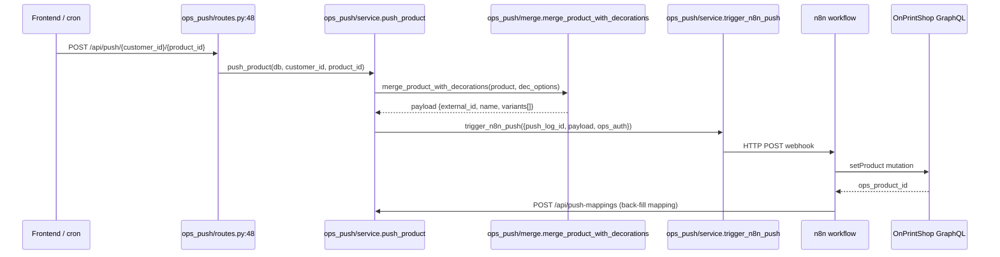
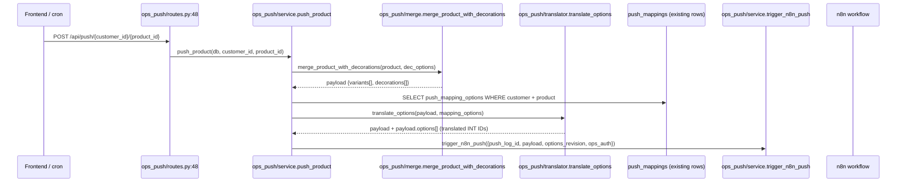
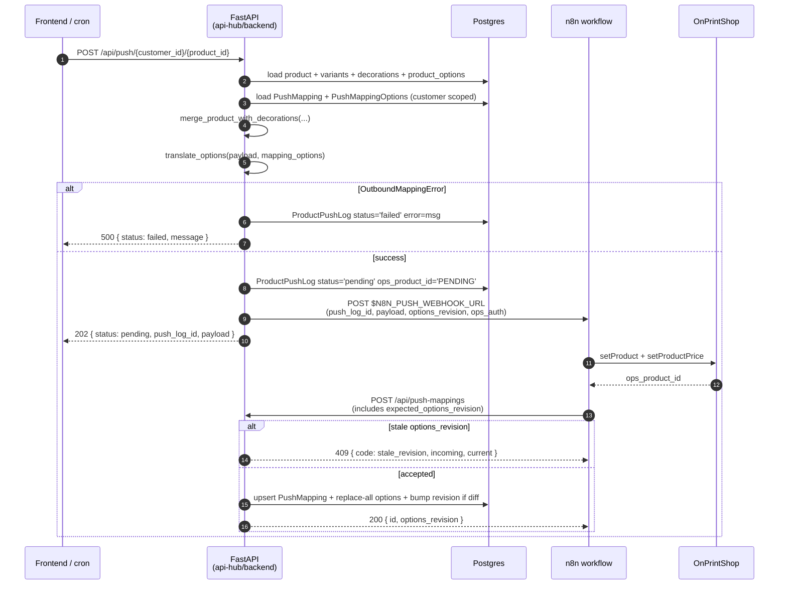

# Option-Mapping Translator + Inbound Dead-Letter + Lock Policy — Implementation Plan

> **For agentic workers:** REQUIRED SUB-SKILL: Use superpowers:subagent-driven-development (recommended) or superpowers:executing-plans to implement this plan task-by-task. Steps use checkbox (`- [ ]`) syntax for tracking.

**Goal:** Add an outbound option-translation layer that uses existing `push_mapping_options` rows to swap VG master option IDs for customer-side OPS option IDs in the n8n push payload, plus a `pending_resolutions` dead-letter table for unmapped inbound webhooks, plus per-customer + per-product lock policy and source-attribution for `externally_available`.

**Architecture:** No new mapping table. Extend `push_mappings` with `options_revision` for retry-stale-payload idempotency. Add a single `pending_resolutions` table for inbound asymmetry. Translator hooks BETWEEN `merge_product_with_decorations` output and `trigger_n8n_push` so decoration overlay composes with option translation. All INT keys (no UUID conversion). Lock policy uses `customers.default_externally_locked` + `products.externally_locked_override` resolver.

**Tech Stack:** Python 3.12, FastAPI, SQLAlchemy 2.0 async, asyncpg, PostgreSQL 16, Alembic, Pydantic v2, pytest-asyncio.

**Scope check:** This plan covers three concerns that share a single migration and ship as one sprint: (1) outbound translator, (2) inbound dead-letter, (3) lock+source policy. They are NOT independently shippable — the migration is atomic and the contract doc spans them. Keep as one plan.

---

## File Structure

| Path | Action | Responsibility |
|------|--------|----------------|
| `api-hub/docs/adr/2026-05-11-push-mapping-reconciliation.md` | Create | Reconciliation ADR — pins all 8 conditions (INT-key contract, NULL semantics, decoration composition, backfill posture, etc.) |
| `api-hub/docs/module_reconciliation.md` | Create | Mermaid flow spec — master_options → merge → translator → trigger_n8n_push |
| `api-hub/docs/fastapi_n8n_contract.md` | Create | Sequence diagram + contract table for n8n ↔ FastAPI push handshake |
| `api-hub/backend/alembic/versions/0002_mapping_revision_dead_letter_lock.py` | Create | Single migration: `options_revision`, lock columns, source column, `pending_resolutions` table |
| `api-hub/backend/modules/push_mappings/models.py` | Modify | Add `options_revision: Mapped[int]` on `PushMapping` |
| `api-hub/backend/modules/push_mappings/service.py` | Modify | Bump `options_revision` atomically inside `upsert_push_mapping` after option replace |
| `api-hub/backend/modules/push_mappings/schemas.py` | Modify | Add `options_revision` to `PushMappingRead`; add `expected_options_revision` to upsert schema for stale-write guard |
| `api-hub/backend/modules/customers/models.py` | Modify | Add `default_externally_locked: Mapped[bool]` |
| `api-hub/backend/modules/catalog/models.py` | Modify | Add `externally_locked_override`, `externally_available`, `externally_available_source` on `Product` |
| `api-hub/backend/modules/ops_push/translator.py` | Create | `translate_options(merged_payload, mapping_options) -> merged_payload` — pure function; raises `OutboundMappingError` on NULL `target_ops_option_id` for any options requested by the payload |
| `api-hub/backend/modules/ops_push/service.py` | Modify | Call translator between `merge_product_with_decorations` and `trigger_n8n_push`; include `options_revision` in webhook payload |
| `api-hub/backend/modules/ops_push/errors.py` | Create | `OutboundMappingError`, `StaleRevisionError` |
| `api-hub/backend/modules/pending_resolutions/__init__.py` | Create | Module package marker |
| `api-hub/backend/modules/pending_resolutions/models.py` | Create | `PendingResolution` model with UniqueConstraint(source_system, source_signature) |
| `api-hub/backend/modules/pending_resolutions/schemas.py` | Create | Pydantic schemas |
| `api-hub/backend/modules/pending_resolutions/service.py` | Create | `upsert_pending_resolution()` using ON CONFLICT to increment `seen_count` |
| `api-hub/backend/modules/pending_resolutions/routes.py` | Create | `POST /api/inbound/webhook` returns 202; `GET /api/pending-resolutions` list |
| `api-hub/backend/modules/catalog/persist_product.py` | Modify | Source-aware write guard: refuse overwrite of `externally_available_*` when existing source is `customer_ui` and incoming source is `ops_sync` |
| `api-hub/backend/modules/catalog/lock_resolver.py` | Create | `resolve_locked(product, customer) -> bool` — override wins over default |
| `api-hub/backend/main.py` | Modify | Register `pending_resolutions` router; add `options_revision`/lock/source columns to `_SCHEMA_UPGRADES` for test-DB idempotency |
| `api-hub/backend/tests/test_translator.py` | Create | U-1, U-2, U-3, U-8 |
| `api-hub/backend/tests/test_pending_resolutions.py` | Create | I-2, I-5, I-6 |
| `api-hub/backend/tests/test_lock_resolver.py` | Create | U-5, U-6 |
| `api-hub/backend/tests/test_persist_product_source_guard.py` | Create | U-7 |
| `api-hub/backend/tests/test_push_callback_stale_revision.py` | Create | U-8 (callback path) |
| `api-hub/backend/tests/test_schema_fingerprint.py` | Create | F-1 — pins `push_mapping_options` column set |
| `api-hub/backend/tests/test_mapping_revision_concurrency.py` | Create | I-3 |

---

## Pre-flight

- [ ] **Step 0.1: Branch off main**

```bash
cd /Users/tanishq/Documents/project-files/api-hub
git checkout main && git pull
git checkout -b feat/option-mapping-translator
```

- [ ] **Step 0.2: Verify clean test baseline**

Run: `cd api-hub/backend && source .venv/bin/activate && pytest -x -q`
Expected: green or only pre-existing skips. If failures unrelated to this plan, halt and escalate.

---

## Task 1: Reconciliation ADR (NO DDL)

**Files:**
- Create: `api-hub/docs/adr/2026-05-11-push-mapping-reconciliation.md`

This is the governance gate. Migration tasks (Task 3+) are blocked until this ADR is committed.

- [ ] **Step 1.1: Write ADR**

Create file with exactly this content:

```markdown
# ADR — Push Mapping Reconciliation & Translator Strategy

**Status:** Accepted
**Date:** 2026-05-11
**Sprint:** N+1

## Context

The April 21 client meeting introduced three requirements: (1) per-customer master-option ↔ product-option mapping for outbound push and inbound order resolution, (2) an `externally_available` flag, (3) an `externally_locked` flag set by API-HUB on customer-side OPS. Direct code read shows `push_mapping_options` already carries the source/target columns needed; a separate `option_mappings` table would duplicate it.

## Decision

1. **Extend, do not duplicate.** Use existing `push_mapping_options` (`api-hub/backend/modules/push_mappings/models.py:47-70`) for outbound option translation. Add `options_revision` to `push_mappings` for retry-stale-payload guard.
2. **Inbound asymmetry → separate table.** New `pending_resolutions` table for orphan webhooks. HTTP 202, not 4xx. `UniqueConstraint(source_system, source_signature)` + `seen_count` for dedup.
3. **No `direction` discriminator.** Outbound and inbound semantics differ irreconcilably (replace-all idempotent vs append-event-driven); polymorphic row rejected.
4. **No `/api/push/build-payload` endpoint.** Existing `POST /api/push/{customer_id}/{product_id}` at `api-hub/backend/modules/ops_push/routes.py:48` already returns the prepared payload.

## Eight Pinned Conditions

| # | Condition | Decision |
|---|-----------|----------|
| C1 | `options_revision` bump trigger | Service-layer bump in `push_mappings/service.py` inside `upsert_push_mapping`, atomic with the option replace-all (`service.py:43-65`). NOT a Postgres trigger — avoids silent bumps from migrations/backfills. |
| C2 | `externally_available_source` NULL semantics | NULL = legacy/unknown, treated as `'ops_sync'` for write-guard purposes. New ingests MUST set explicitly. |
| C3 | `pending_resolutions` dedup | Handler MUST use `pg_insert().on_conflict_do_update(...)` to increment `seen_count` on `(source_system, source_signature)` collision. |
| C4 | Pre-mortem Scenario D — revision false positives | Bump only when the new options list differs from the existing one (set comparison on `(source_master_option_id, target_ops_option_id, source_master_attribute_id, target_ops_attribute_id)`). No-op upserts do not bump. |
| C5 | `products.external_catalogue` vs `externally_available_source` | Distinct: `external_catalogue INTEGER` = OPS catalog ID (data), `externally_available_source VARCHAR(20)` = governance/write-policy. Ingest path at `ops_adapter.py:187` MUST NOT write `externally_available_source`. |
| C6 | Stale revision callback | Callback POST `/api/push-mappings` with `expected_options_revision < current.options_revision` → 409; caller must refetch payload. |
| C7 | Backfill posture | V1 stage; no production customers; `default_externally_locked DEFAULT FALSE` accepted. Documented in migration notes. |
| C8 | Decoration composition | Translator runs AFTER `merge_product_with_decorations` (`api-hub/backend/modules/ops_push/merge.py:52-60`) and BEFORE `trigger_n8n_push` (`api-hub/backend/modules/ops_push/service.py:123`). Decoration overlay preserved; option translation augments. Signature: `translate_options(merged_payload: dict, mapping_options: list[PushMappingOption]) -> dict`. |

## INT-Key Contract

All option/attribute keys flow as `int`:
- `master_options.ops_master_option_id` (`master_options/models.py:21`)
- `product_options.master_option_id` (`catalog/models.py:133`)
- `push_mapping_options.source_master_option_id` / `target_ops_option_id` (`push_mappings/models.py:59,63`)

Translator MUST NOT introduce UUID conversion in the payload path.

## Alternatives Rejected

- **Option A** (new `option_mappings` table + `direction` discriminator): duplicates existing `push_mapping_options`; polymorphic row anti-pattern.
- **Option B** (two unidirectional tables): still duplicates outbound table; discards existing replace-all upsert.

## Consequences

**Positive:** One migration; reuses existing service path; inbound dead-letter is auditable.
**Negative:** `push_mapping_options` implicitly carries "outbound only" semantics — enforced by docstring + schema fingerprint test + ADR-gate in CI.

## Follow-ups (Sprint N+2/N+3)

- Operator UI for `pending_resolutions`
- 90-day retention job
- Metrics + alerting on revision rejection / dead-letter rate
- Future ADR required before any new column on `push_mapping_options`
```

- [ ] **Step 1.2: Commit ADR**

```bash
git add api-hub/docs/adr/2026-05-11-push-mapping-reconciliation.md
git commit -m "docs(adr): push mapping reconciliation — extend push_mapping_options, no new table"
```

---

## Task 2: Module Reconciliation Flow Spec (NO DDL)

**Files:**
- Create: `api-hub/docs/module_reconciliation.md`

- [ ] **Step 2.1: Write flow spec**

```markdown
# Module Reconciliation — Outbound Push Flow

## Existing data path (today)



## Target path (after Sprint N+1)



## Data sources for option translation

| Source | File | Field | Purpose |
|--------|------|-------|---------|
| Global master option catalog | `master_options/models.py:15-35` | `ops_master_option_id INT UNIQUE` | What option exists in OPS |
| Per-product enablement | `catalog/models.py:122-146` | `product_options.master_option_id INT` | Which options this product has |
| Per-customer translation | `push_mappings/models.py:47-70` | `push_mapping_options.source_master_option_id INT → target_ops_option_id INT` | Customer-side OPS ID |

## Decoration composition rule

Decorations (`modules/decorations/models.py:CustomerProductDecoration`) overlay variants with placement + method + price. Option translation works on a SEPARATE field of the payload (`options[]`), produced from `product_options`. Variants and decorations are untouched by the translator.
```

- [ ] **Step 2.2: Commit flow spec**

```bash
git add api-hub/docs/module_reconciliation.md
git commit -m "docs: module reconciliation flow spec for option translator"
```

---

## Task 3: Alembic Migration (single migration, all deltas)

**Files:**
- Create: `api-hub/backend/alembic/versions/0002_mapping_revision_dead_letter_lock.py`

- [ ] **Step 3.1: Write migration**

```python
"""Mapping revision, dead-letter table, lock policy, source attribution.

Revision ID: 0002_mapping_revision_dead_letter_lock
Revises: 0001_baseline
Create Date: 2026-05-11

Adds:
- push_mappings.options_revision (int, default 0) — retry-stale-payload guard
- customers.default_externally_locked (bool, default false)
- products.externally_locked_override (bool, nullable) — override resolver
- products.externally_available (bool, default true)
- products.externally_available_source (varchar(20), nullable, check constraint)
- pending_resolutions table for inbound dead-letter

Backfill posture: V1 stage, no production customers; default-false on
default_externally_locked is acceptable per ADR 2026-05-11.
"""
from alembic import op


revision = "0002_mapping_revision_dead_letter_lock"
down_revision = "0001_baseline"
branch_labels = None
depends_on = None


def upgrade() -> None:
    op.execute("""
        ALTER TABLE push_mappings
            ADD COLUMN IF NOT EXISTS options_revision INTEGER NOT NULL DEFAULT 0;
    """)

    op.execute("""
        ALTER TABLE customers
            ADD COLUMN IF NOT EXISTS default_externally_locked BOOLEAN NOT NULL DEFAULT FALSE;
    """)

    op.execute("""
        ALTER TABLE products
            ADD COLUMN IF NOT EXISTS externally_locked_override BOOLEAN NULL,
            ADD COLUMN IF NOT EXISTS externally_available BOOLEAN NOT NULL DEFAULT TRUE,
            ADD COLUMN IF NOT EXISTS externally_available_source VARCHAR(20) NULL;
    """)

    op.execute("""
        ALTER TABLE products
            DROP CONSTRAINT IF EXISTS chk_externally_available_source;
        ALTER TABLE products
            ADD CONSTRAINT chk_externally_available_source
            CHECK (externally_available_source IS NULL
                   OR externally_available_source IN ('customer_ui','ops_sync','inbound_webhook'));
    """)

    op.execute("""
        CREATE INDEX IF NOT EXISTS idx_products_externally_available
            ON products (externally_available)
            WHERE externally_available = TRUE;
    """)

    op.execute("""
        CREATE TABLE IF NOT EXISTS pending_resolutions (
            id UUID PRIMARY KEY DEFAULT gen_random_uuid(),
            source_system VARCHAR(50) NOT NULL,
            source_payload JSONB NOT NULL,
            unmapped_field VARCHAR(100) NOT NULL,
            source_signature CHAR(64) NOT NULL,
            seen_count INTEGER NOT NULL DEFAULT 1,
            received_at TIMESTAMPTZ NOT NULL DEFAULT now(),
            resolved_at TIMESTAMPTZ NULL,
            status VARCHAR(20) NOT NULL DEFAULT 'pending'
                CHECK (status IN ('pending','resolved','dismissed')),
            signature_verified BOOLEAN NOT NULL DEFAULT FALSE,
            customer_id UUID NULL REFERENCES customers(id) ON DELETE CASCADE,
            product_id UUID NULL REFERENCES products(id) ON DELETE SET NULL,
            CONSTRAINT uq_pending_resolution_signature
                UNIQUE (source_system, source_signature)
        );
    """)

    op.execute("""
        CREATE INDEX IF NOT EXISTS idx_pending_resolutions_status
            ON pending_resolutions (status, received_at);
    """)


def downgrade() -> None:
    op.execute("DROP TABLE IF EXISTS pending_resolutions;")
    op.execute("DROP INDEX IF EXISTS idx_products_externally_available;")
    op.execute("ALTER TABLE products DROP CONSTRAINT IF EXISTS chk_externally_available_source;")
    op.execute("""
        ALTER TABLE products
            DROP COLUMN IF EXISTS externally_available_source,
            DROP COLUMN IF EXISTS externally_available,
            DROP COLUMN IF EXISTS externally_locked_override;
    """)
    op.execute("ALTER TABLE customers DROP COLUMN IF EXISTS default_externally_locked;")
    op.execute("ALTER TABLE push_mappings DROP COLUMN IF EXISTS options_revision;")
```

- [ ] **Step 3.2: Run migration on local DB**

```bash
cd api-hub/backend && source .venv/bin/activate
alembic upgrade head
```

Expected: `Running upgrade 0001_baseline -> 0002_mapping_revision_dead_letter_lock`

- [ ] **Step 3.3: Verify migration in psql**

```bash
docker compose -f /Users/tanishq/Documents/project-files/api-hub/api-hub/docker-compose.yml exec postgres psql -U vg_user -d vg_hub -c "\d+ push_mappings" | grep options_revision
docker compose -f /Users/tanishq/Documents/project-files/api-hub/api-hub/docker-compose.yml exec postgres psql -U vg_user -d vg_hub -c "\d+ pending_resolutions"
```

Expected: `options_revision | integer | not null | 0` and full `pending_resolutions` schema.

- [ ] **Step 3.4: Test downgrade then re-upgrade**

```bash
alembic downgrade 0001_baseline
alembic upgrade head
```

Expected: both commands clean exit; psql verification still shows new columns after re-upgrade.

- [ ] **Step 3.5: Commit migration**

```bash
git add api-hub/backend/alembic/versions/0002_mapping_revision_dead_letter_lock.py
git commit -m "feat(migration): options_revision + pending_resolutions + lock/source columns"
```

---

## Task 4: Update SQLAlchemy models + test-schema upgrades

**Files:**
- Modify: `api-hub/backend/modules/push_mappings/models.py:13-44`
- Modify: `api-hub/backend/modules/customers/models.py:10-23`
- Modify: `api-hub/backend/modules/catalog/models.py:31-77`
- Modify: `api-hub/backend/main.py` (add to `_SCHEMA_UPGRADES`)

- [ ] **Step 4.1: Add `options_revision` to `PushMapping`**

Edit `api-hub/backend/modules/push_mappings/models.py`. After line 40 (`status` column), add:

```python
    options_revision: Mapped[int] = mapped_column(Integer, nullable=False, default=0)
```

- [ ] **Step 4.2: Add `default_externally_locked` to `Customer`**

Edit `api-hub/backend/modules/customers/models.py`. After line 20 (`is_active`), add:

```python
    default_externally_locked: Mapped[bool] = mapped_column(Boolean, nullable=False, default=False)
```

- [ ] **Step 4.3: Add lock + source columns to `Product`**

Edit `api-hub/backend/modules/catalog/models.py`. After line 56 (`archived_at`), add:

```python
    externally_locked_override: Mapped[Optional[bool]] = mapped_column(Boolean, nullable=True)
    externally_available: Mapped[bool] = mapped_column(Boolean, nullable=False, default=True)
    externally_available_source: Mapped[Optional[str]] = mapped_column(String(20), nullable=True)
```

- [ ] **Step 4.4: Wire `_SCHEMA_UPGRADES` for test DB**

Edit `api-hub/backend/main.py`. Find the `_SCHEMA_UPGRADES` list and append:

```python
    """ALTER TABLE push_mappings ADD COLUMN IF NOT EXISTS options_revision INTEGER NOT NULL DEFAULT 0""",
    """ALTER TABLE customers ADD COLUMN IF NOT EXISTS default_externally_locked BOOLEAN NOT NULL DEFAULT FALSE""",
    """ALTER TABLE products ADD COLUMN IF NOT EXISTS externally_locked_override BOOLEAN NULL""",
    """ALTER TABLE products ADD COLUMN IF NOT EXISTS externally_available BOOLEAN NOT NULL DEFAULT TRUE""",
    """ALTER TABLE products ADD COLUMN IF NOT EXISTS externally_available_source VARCHAR(20) NULL""",
    """ALTER TABLE products DROP CONSTRAINT IF EXISTS chk_externally_available_source""",
    """ALTER TABLE products ADD CONSTRAINT chk_externally_available_source CHECK (externally_available_source IS NULL OR externally_available_source IN ('customer_ui','ops_sync','inbound_webhook'))""",
    """CREATE TABLE IF NOT EXISTS pending_resolutions (
        id UUID PRIMARY KEY DEFAULT gen_random_uuid(),
        source_system VARCHAR(50) NOT NULL,
        source_payload JSONB NOT NULL,
        unmapped_field VARCHAR(100) NOT NULL,
        source_signature CHAR(64) NOT NULL,
        seen_count INTEGER NOT NULL DEFAULT 1,
        received_at TIMESTAMPTZ NOT NULL DEFAULT now(),
        resolved_at TIMESTAMPTZ NULL,
        status VARCHAR(20) NOT NULL DEFAULT 'pending' CHECK (status IN ('pending','resolved','dismissed')),
        signature_verified BOOLEAN NOT NULL DEFAULT FALSE,
        customer_id UUID NULL REFERENCES customers(id) ON DELETE CASCADE,
        product_id UUID NULL REFERENCES products(id) ON DELETE SET NULL,
        CONSTRAINT uq_pending_resolution_signature UNIQUE (source_system, source_signature)
    )""",
```

- [ ] **Step 4.5: Run test suite to ensure no regression**

Run: `cd api-hub/backend && pytest -x -q`
Expected: all pre-existing tests still green.

- [ ] **Step 4.6: Commit**

```bash
git add api-hub/backend/modules/push_mappings/models.py api-hub/backend/modules/customers/models.py api-hub/backend/modules/catalog/models.py api-hub/backend/main.py
git commit -m "feat(models): add options_revision, lock policy, source attribution columns"
```

---

## Task 5: Errors module (named exceptions)

**Files:**
- Create: `api-hub/backend/modules/ops_push/errors.py`

- [ ] **Step 5.1: Write failing test first**

Create `api-hub/backend/tests/test_ops_push_errors.py`:

```python
import pytest


def test_outbound_mapping_error_carries_missing_field():
    from modules.ops_push.errors import OutboundMappingError

    err = OutboundMappingError(missing=[("color", 4711)])
    assert err.missing == [("color", 4711)]
    assert "4711" in str(err)


def test_stale_revision_error_carries_revisions():
    from modules.ops_push.errors import StaleRevisionError

    err = StaleRevisionError(incoming=4, current=5)
    assert err.incoming == 4
    assert err.current == 5
    assert "4" in str(err) and "5" in str(err)
```

- [ ] **Step 5.2: Run — expect import error**

Run: `cd api-hub/backend && pytest tests/test_ops_push_errors.py -v`
Expected: FAIL `ModuleNotFoundError: No module named 'modules.ops_push.errors'`

- [ ] **Step 5.3: Implement errors module**

Create `api-hub/backend/modules/ops_push/errors.py`:

```python
"""Typed exceptions for the OPS push pipeline."""
from typing import Sequence


class OutboundMappingError(Exception):
    """Raised when an outbound push payload references options without target IDs."""

    def __init__(self, missing: Sequence[tuple[str, int]]) -> None:
        self.missing = list(missing)
        detail = ", ".join(f"{key}:{src_id}" for key, src_id in self.missing)
        super().__init__(f"Outbound mapping missing target_ops_option_id for: {detail}")


class StaleRevisionError(Exception):
    """Raised when an n8n callback or upsert carries a revision older than current."""

    def __init__(self, incoming: int, current: int) -> None:
        self.incoming = incoming
        self.current = current
        super().__init__(
            f"Stale options_revision: incoming={incoming} < current={current}"
        )
```

- [ ] **Step 5.4: Run — expect pass**

Run: `cd api-hub/backend && pytest tests/test_ops_push_errors.py -v`
Expected: 2 passed.

- [ ] **Step 5.5: Commit**

```bash
git add api-hub/backend/modules/ops_push/errors.py api-hub/backend/tests/test_ops_push_errors.py
git commit -m "feat(ops_push): typed errors OutboundMappingError + StaleRevisionError"
```

---

## Task 6: Outbound translator (pure function)

**Files:**
- Create: `api-hub/backend/modules/ops_push/translator.py`
- Create: `api-hub/backend/tests/test_translator.py`

- [ ] **Step 6.1: Write failing tests (U-1, U-2, U-8 happy/negative)**

Create `api-hub/backend/tests/test_translator.py`:

```python
"""Unit tests for ops_push.translator.translate_options."""
import pytest


def _make_mapping(source_id: int, target_id: int | None, key: str = "color"):
    """Build a minimal PushMappingOption-shaped object for translator tests."""
    class _MO:
        def __init__(self, src, tgt, k):
            self.source_master_option_id = src
            self.source_master_attribute_id = None
            self.source_option_key = k
            self.source_attribute_key = None
            self.target_ops_option_id = tgt
            self.target_ops_attribute_id = None
            self.title = k.title()
            self.price = None
            self.sort_order = 0
    return _MO(source_id, target_id, key)


def test_translator_passes_through_decoration_overlay():
    """C8: decoration overlay must be preserved through translation."""
    from modules.ops_push.translator import translate_options

    payload = {
        "external_id": "PC61",
        "name": "Tee",
        "variants": [
            {"sku": "PC61-NAVY-M", "color": "Navy", "size": "M",
             "decorations": [{"placement": "front", "method": "dtg", "price": 5.0}]}
        ],
        "requested_options": [
            {"source_master_option_id": 100, "option_key": "color"},
        ],
    }
    mappings = [_make_mapping(100, 9001, "color")]

    out = translate_options(payload, mappings)

    assert out["variants"][0]["decorations"][0]["method"] == "dtg"
    assert out["variants"][0]["decorations"][0]["price"] == 5.0


def test_translator_writes_target_ops_option_id():
    """U-1 happy path: source IDs swapped for target OPS IDs."""
    from modules.ops_push.translator import translate_options

    payload = {
        "requested_options": [
            {"source_master_option_id": 100, "option_key": "color"},
            {"source_master_option_id": 200, "option_key": "size"},
        ],
    }
    mappings = [
        _make_mapping(100, 9001, "color"),
        _make_mapping(200, 9002, "size"),
    ]

    out = translate_options(payload, mappings)

    target_ids = sorted(o["target_ops_option_id"] for o in out["options"])
    assert target_ids == [9001, 9002]


def test_translator_raises_on_null_target():
    """U-2 negative: NULL target_ops_option_id raises OutboundMappingError."""
    from modules.ops_push.translator import translate_options
    from modules.ops_push.errors import OutboundMappingError

    payload = {
        "requested_options": [
            {"source_master_option_id": 100, "option_key": "color"},
        ],
    }
    mappings = [_make_mapping(100, None, "color")]

    with pytest.raises(OutboundMappingError) as exc:
        translate_options(payload, mappings)
    assert ("color", 100) in exc.value.missing


def test_translator_raises_on_missing_mapping_row():
    """U-2b negative: no mapping row at all for requested option."""
    from modules.ops_push.translator import translate_options
    from modules.ops_push.errors import OutboundMappingError

    payload = {
        "requested_options": [
            {"source_master_option_id": 300, "option_key": "material"},
        ],
    }
    mappings: list = []

    with pytest.raises(OutboundMappingError) as exc:
        translate_options(payload, mappings)
    assert ("material", 300) in exc.value.missing


def test_translator_returns_empty_options_when_no_requests():
    """Edge: payload with no requested_options produces empty options[] array."""
    from modules.ops_push.translator import translate_options

    payload = {"variants": [{"sku": "X"}]}
    out = translate_options(payload, [])

    assert out["options"] == []
    assert out["variants"][0]["sku"] == "X"
```

- [ ] **Step 6.2: Run tests — expect import failure**

Run: `cd api-hub/backend && pytest tests/test_translator.py -v`
Expected: FAIL `ModuleNotFoundError: No module named 'modules.ops_push.translator'`

- [ ] **Step 6.3: Implement translator**

Create `api-hub/backend/modules/ops_push/translator.py`:

```python
"""Outbound option translator.

Maps VG master option IDs (source) to customer-side OPS option IDs (target)
using rows from push_mapping_options. Pure function — no DB access; the caller
provides the mapping rows already loaded.

Composes with decoration overlay (variants[].decorations[]) — translator does
NOT touch variants. See docs/adr/2026-05-11-push-mapping-reconciliation.md C8.
"""
from typing import Any, Iterable

from .errors import OutboundMappingError


def translate_options(
    payload: dict[str, Any],
    mapping_options: Iterable[Any],
) -> dict[str, Any]:
    """Resolve requested options against mapping rows and append translated options[].

    Input payload shape (from merge_product_with_decorations + caller annotation):
        {
            "external_id": str,
            "name": str,
            "variants": [...],          # untouched
            "requested_options": [       # what the product needs in OPS
                {"source_master_option_id": int, "option_key": str},
                ...
            ],
        }

    Returns the same payload dict mutated with payload["options"] = [
        {"target_ops_option_id": int, "title": str, "sort_order": int, ...},
        ...
    ].

    Raises:
        OutboundMappingError: any requested option has no row with non-null
            target_ops_option_id.
    """
    # Build lookup: source_master_option_id -> mapping row with non-null target.
    by_source: dict[int, Any] = {}
    for mo in mapping_options:
        src = mo.source_master_option_id
        tgt = mo.target_ops_option_id
        if src is None or tgt is None:
            continue
        by_source[src] = mo

    requested = payload.get("requested_options") or []
    translated: list[dict[str, Any]] = []
    missing: list[tuple[str, int]] = []

    for req in requested:
        src_id = req.get("source_master_option_id")
        key = req.get("option_key") or ""
        if src_id is None:
            missing.append((key, -1))
            continue
        row = by_source.get(src_id)
        if row is None:
            missing.append((key, src_id))
            continue
        translated.append({
            "target_ops_option_id": row.target_ops_option_id,
            "target_ops_attribute_id": row.target_ops_attribute_id,
            "source_master_option_id": row.source_master_option_id,
            "source_option_key": row.source_option_key,
            "title": row.title or key,
            "sort_order": row.sort_order or 0,
        })

    if missing:
        raise OutboundMappingError(missing=missing)

    payload["options"] = translated
    return payload
```

- [ ] **Step 6.4: Run tests — expect pass**

Run: `cd api-hub/backend && pytest tests/test_translator.py -v`
Expected: 5 passed.

- [ ] **Step 6.5: Commit**

```bash
git add api-hub/backend/modules/ops_push/translator.py api-hub/backend/tests/test_translator.py
git commit -m "feat(ops_push): outbound option translator with NULL-target guard"
```

---

## Task 7: Revision bump in `upsert_push_mapping`

**Files:**
- Modify: `api-hub/backend/modules/push_mappings/service.py`
- Modify: `api-hub/backend/modules/push_mappings/schemas.py`
- Create: `api-hub/backend/tests/test_mapping_revision_concurrency.py`

- [ ] **Step 7.1: Write failing test (I-3 + U-3 + diff-no-op C4)**

Create `api-hub/backend/tests/test_mapping_revision_concurrency.py`:

```python
"""Mapping revision tests — bump rule + stale-write guard."""
import uuid
from decimal import Decimal

import pytest
from sqlalchemy import select

from modules.customers.models import Customer
from modules.suppliers.models import Supplier
from modules.catalog.models import Product
from modules.push_mappings.models import PushMapping
from modules.push_mappings.schemas import PushMappingUpsert, PushMappingOptionIngest
from modules.push_mappings.service import upsert_push_mapping


@pytest.fixture
async def seed(db):
    supplier = Supplier(
        id=uuid.uuid4(), name="VG OPS", slug="vg-ops-test",
        protocol="promostandards", promostandards_code="VG",
    )
    customer = Customer(
        id=uuid.uuid4(), name="Cust",
        ops_base_url="https://test.ops.com",
        ops_token_url="https://test.ops.com/token",
        ops_client_id="cid",
    )
    db.add_all([supplier, customer])
    await db.flush()

    product = Product(
        id=uuid.uuid4(), supplier_id=supplier.id,
        supplier_sku="PC61", product_name="Tee", product_type="apparel",
    )
    db.add(product)
    await db.commit()
    return {"customer": customer, "product": product}


def _opt(src_id: int, tgt_id: int, key: str = "color"):
    return PushMappingOptionIngest(
        source_master_option_id=src_id,
        target_ops_option_id=tgt_id,
        source_option_key=key,
        title=key.title(),
        price=Decimal("0.00"),
        sort_order=0,
    )


def _data(customer_id, product_id, options):
    return PushMappingUpsert(
        source_system="vg",
        source_product_id=product_id,
        customer_id=customer_id,
        target_ops_base_url="https://test.ops.com",
        target_ops_product_id=11,
        options=options,
    )


@pytest.mark.asyncio
async def test_first_upsert_sets_revision_to_one(seed, db):
    """C4: first write that introduces options bumps revision 0 -> 1."""
    data = _data(seed["customer"].id, seed["product"].id, [_opt(100, 9001)])
    mapping_id = await upsert_push_mapping(db, data)

    row = (await db.execute(
        select(PushMapping).where(PushMapping.id == mapping_id)
    )).scalar_one()
    assert row.options_revision == 1


@pytest.mark.asyncio
async def test_repeated_upsert_same_options_does_not_bump(seed, db):
    """C4: no-op upsert (same option set) keeps revision unchanged."""
    data = _data(seed["customer"].id, seed["product"].id, [_opt(100, 9001)])
    await upsert_push_mapping(db, data)
    await upsert_push_mapping(db, data)

    row = (await db.execute(
        select(PushMapping).where(
            PushMapping.source_product_id == seed["product"].id,
            PushMapping.customer_id == seed["customer"].id,
        )
    )).scalar_one()
    assert row.options_revision == 1


@pytest.mark.asyncio
async def test_changed_options_bumps_revision(seed, db):
    """I-3: changing the option set bumps revision."""
    await upsert_push_mapping(
        db, _data(seed["customer"].id, seed["product"].id, [_opt(100, 9001)])
    )
    await upsert_push_mapping(
        db, _data(seed["customer"].id, seed["product"].id, [_opt(100, 9002)])
    )

    row = (await db.execute(
        select(PushMapping).where(
            PushMapping.source_product_id == seed["product"].id,
            PushMapping.customer_id == seed["customer"].id,
        )
    )).scalar_one()
    assert row.options_revision == 2
```

- [ ] **Step 7.2: Run — expect fail (no revision logic yet)**

Run: `cd api-hub/backend && pytest tests/test_mapping_revision_concurrency.py -v`
Expected: FAIL — `options_revision == 1` assertion fails (column defaults to 0).

- [ ] **Step 7.3: Implement diff-aware revision bump**

Replace the body of `upsert_push_mapping` in `api-hub/backend/modules/push_mappings/service.py`:

```python
async def upsert_push_mapping(db: AsyncSession, data: PushMappingUpsert) -> UUID:
    now = datetime.now(timezone.utc)

    stmt = (
        pg_insert(PushMapping)
        .values(
            source_system=data.source_system,
            source_product_id=data.source_product_id,
            source_supplier_sku=data.source_supplier_sku,
            customer_id=data.customer_id,
            target_ops_base_url=data.target_ops_base_url,
            target_ops_product_id=data.target_ops_product_id,
            pushed_at=now,
            updated_at=now,
            status="active",
            options_revision=0,
        )
        .on_conflict_do_update(
            index_elements=["source_product_id", "customer_id"],
            set_={
                "target_ops_product_id": data.target_ops_product_id,
                "target_ops_base_url": data.target_ops_base_url,
                "updated_at": now,
                "status": "active",
            },
        )
        .returning(PushMapping.id, PushMapping.options_revision)
    )

    row = (await db.execute(stmt)).one()
    mapping_id: UUID = row[0]
    current_revision: int = row[1]

    # Load existing options to compute diff vs incoming set
    existing = (
        await db.execute(
            select(PushMappingOption).where(PushMappingOption.push_mapping_id == mapping_id)
        )
    ).scalars().all()

    def _key(o):
        return (
            o.source_master_option_id,
            o.source_master_attribute_id,
            o.target_ops_option_id,
            o.target_ops_attribute_id,
        )

    existing_keys = {_key(o) for o in existing}
    incoming_keys = {
        (
            opt.source_master_option_id,
            opt.source_master_attribute_id,
            opt.target_ops_option_id,
            opt.target_ops_attribute_id,
        )
        for opt in data.options
    }

    options_changed = existing_keys != incoming_keys

    # Replace-all options (existing pattern)
    await db.execute(
        delete(PushMappingOption).where(PushMappingOption.push_mapping_id == mapping_id)
    )

    for opt in data.options:
        db.add(
            PushMappingOption(
                push_mapping_id=mapping_id,
                source_master_option_id=opt.source_master_option_id,
                source_master_attribute_id=opt.source_master_attribute_id,
                source_option_key=opt.source_option_key,
                source_attribute_key=opt.source_attribute_key,
                target_ops_option_id=opt.target_ops_option_id,
                target_ops_attribute_id=opt.target_ops_attribute_id,
                title=opt.title,
                price=opt.price,
                sort_order=opt.sort_order,
                created_at=now,
            )
        )

    # C4: bump only when option set actually changed (no-op upserts stay still)
    if options_changed:
        mapping = (await db.execute(
            select(PushMapping).where(PushMapping.id == mapping_id)
        )).scalar_one()
        mapping.options_revision = current_revision + 1

    await db.commit()
    return mapping_id
```

- [ ] **Step 7.4: Run revision tests — expect pass**

Run: `cd api-hub/backend && pytest tests/test_mapping_revision_concurrency.py -v`
Expected: 3 passed.

- [ ] **Step 7.5: Run full test suite — no regressions**

Run: `cd api-hub/backend && pytest -x -q`
Expected: all previously-green tests still green.

- [ ] **Step 7.6: Add `options_revision` to read schema**

Edit `api-hub/backend/modules/push_mappings/schemas.py`. Add to `PushMappingRead` after the `status` field (line 51):

```python
    options_revision: int = 0
```

And add an optional stale-write guard field to `PushMappingUpsert` after the `target_ops_product_id` field (line 27):

```python
    expected_options_revision: Optional[int] = None
```

- [ ] **Step 7.7: Commit**

```bash
git add api-hub/backend/modules/push_mappings/service.py api-hub/backend/modules/push_mappings/schemas.py api-hub/backend/tests/test_mapping_revision_concurrency.py
git commit -m "feat(push_mappings): diff-aware options_revision bump in upsert"
```

---

## Task 8: Wire translator into push pipeline

**Files:**
- Modify: `api-hub/backend/modules/ops_push/service.py`

- [ ] **Step 8.1: Write integration test (with translator in path)**

Create `api-hub/backend/tests/test_push_with_translator.py`:

```python
"""Integration: push pipeline calls translator and includes options_revision."""
import uuid
from decimal import Decimal
from unittest.mock import AsyncMock, patch

import pytest
from sqlalchemy import select

from modules.customers.models import Customer
from modules.suppliers.models import Supplier
from modules.catalog.models import Product, ProductVariant, ProductOption
from modules.push_mappings.models import PushMapping, PushMappingOption


@pytest.fixture
async def setup(db):
    supplier = Supplier(
        id=uuid.uuid4(), name="VG", slug="vg-ops-test",
        protocol="promostandards", promostandards_code="VG",
        push_name_prefix="VG-",
    )
    customer = Customer(
        id=uuid.uuid4(), name="Cust",
        ops_base_url="https://test.ops.com",
        ops_token_url="https://test.ops.com/token",
        ops_client_id="cid",
    )
    db.add_all([supplier, customer])
    await db.flush()

    product = Product(
        id=uuid.uuid4(), supplier_id=supplier.id,
        supplier_sku="PC61", product_name="Tee", product_type="apparel",
    )
    db.add(product)
    await db.flush()

    db.add(ProductVariant(
        id=uuid.uuid4(), product_id=product.id,
        sku="PC61-NAVY-M", color="Navy", size="M", base_price=Decimal("10.00"),
    ))
    db.add(ProductOption(
        id=uuid.uuid4(), product_id=product.id,
        master_option_id=100, option_key="color", title="Color",
        enabled=True, status=1,
    ))

    from datetime import datetime, timezone
    now = datetime.now(timezone.utc)
    pm = PushMapping(
        id=uuid.uuid4(), source_system="vg",
        source_product_id=product.id, customer_id=customer.id,
        target_ops_base_url="https://test.ops.com", target_ops_product_id=42,
        pushed_at=now, updated_at=now, status="active", options_revision=3,
    )
    db.add(pm)
    await db.flush()
    db.add(PushMappingOption(
        id=uuid.uuid4(), push_mapping_id=pm.id,
        source_master_option_id=100, target_ops_option_id=9001,
        source_option_key="color", title="Color", sort_order=0,
        created_at=now,
    ))
    await db.commit()
    return {"customer": customer, "product": product, "mapping": pm}


@pytest.mark.asyncio
async def test_push_includes_translated_options_and_revision(setup, client):
    """Trigger payload to n8n must contain options[] from translator and options_revision."""
    captured: dict = {}

    async def fake_trigger(payload):
        captured.update(payload)

    with patch(
        "modules.ops_push.service.trigger_n8n_push",
        new=AsyncMock(side_effect=fake_trigger),
    ):
        res = await client.post(
            f"/api/push/{setup['customer'].id}/{setup['product'].id}"
        )
        assert res.status_code == 202

    assert captured["options_revision"] == 3
    options = captured["payload"]["options"]
    assert any(o["target_ops_option_id"] == 9001 for o in options)
```

- [ ] **Step 8.2: Run — expect fail**

Run: `cd api-hub/backend && pytest tests/test_push_with_translator.py -v`
Expected: FAIL — `options_revision` key missing OR `options` list empty.

- [ ] **Step 8.3: Wire translator into `push_product`**

Edit `api-hub/backend/modules/ops_push/service.py`. Replace the function `push_product` body's section between the merge call and the `trigger_n8n_push` call.

After the existing line `payload = merge_product_with_decorations(product, dec_options)` (line 76), insert:

```python
    # Annotate payload with requested_options derived from ProductOption rows
    from modules.catalog.models import ProductOption
    from modules.push_mappings.models import PushMappingOption as _PMO
    from .translator import translate_options
    from .errors import OutboundMappingError

    requested_rows = (await db.execute(
        select(ProductOption).where(
            ProductOption.product_id == product_id,
            ProductOption.enabled == True,  # noqa: E712
            ProductOption.master_option_id.is_not(None),
        )
    )).scalars().all()
    payload["requested_options"] = [
        {"source_master_option_id": r.master_option_id, "option_key": r.option_key}
        for r in requested_rows
    ]

    # Load mapping options scoped to this customer+product (if any prior push)
    mapping_options: list = []
    current_revision = 0
    prior_mapping = (await db.execute(
        select(PushMapping).where(
            PushMapping.source_product_id == product_id,
            PushMapping.customer_id == customer_id,
        )
    )).scalar_one_or_none()
    if prior_mapping is not None:
        current_revision = prior_mapping.options_revision
        mapping_options = (await db.execute(
            select(_PMO).where(_PMO.push_mapping_id == prior_mapping.id)
        )).scalars().all()

    # If no mapping rows yet (first push), translator emits empty options[] only when
    # there are no requested_options; otherwise it raises and push_log goes 'failed'.
    try:
        payload = translate_options(payload, mapping_options)
    except OutboundMappingError as e:
        push_log = ProductPushLog(
            product_id=product_id,
            customer_id=customer_id,
            status="failed",
            error=str(e),
            pushed_at=datetime.now(timezone.utc),
            ops_product_id="UNMAPPED",
        )
        db.add(push_log)
        await db.commit()
        return {"status": "failed", "message": str(e)}
```

Then locate the existing `await trigger_n8n_push({...` call (line 123). Add `"options_revision": current_revision` to the dict:

```python
        await trigger_n8n_push({
            "push_log_id": str(push_log.id),
            "customer_id": str(customer_id),
            "product_id": str(product_id),
            "payload": payload,
            "options_revision": current_revision,
            "ops_auth": {
                "base_url": customer.ops_base_url,
                "token_url": customer.ops_token_url,
                "client_id": customer.ops_client_id,
                "client_secret": (customer.ops_auth_config or {}).get("client_secret")
            }
        })
```

Add the missing import at the top of `service.py` if not present:

```python
from sqlalchemy import select
```

(already imported at line 8 — verify before adding).

- [ ] **Step 8.4: Run translator integration test — expect pass**

Run: `cd api-hub/backend && pytest tests/test_push_with_translator.py -v`
Expected: 1 passed.

- [ ] **Step 8.5: Run full ops_push suite — no regression**

Run: `cd api-hub/backend && pytest tests/test_ops_push.py tests/test_ops_push_failure.py -v`
Expected: pre-existing tests still pass.

- [ ] **Step 8.6: Commit**

```bash
git add api-hub/backend/modules/ops_push/service.py api-hub/backend/tests/test_push_with_translator.py
git commit -m "feat(ops_push): wire translator + options_revision into push payload"
```

---

## Task 9: Pending Resolutions module (dead-letter)

**Files:**
- Create: `api-hub/backend/modules/pending_resolutions/__init__.py`
- Create: `api-hub/backend/modules/pending_resolutions/models.py`
- Create: `api-hub/backend/modules/pending_resolutions/schemas.py`
- Create: `api-hub/backend/modules/pending_resolutions/service.py`
- Create: `api-hub/backend/modules/pending_resolutions/routes.py`
- Create: `api-hub/backend/tests/test_pending_resolutions.py`

- [ ] **Step 9.1: Write failing tests (I-2, I-5, I-6)**

Create `api-hub/backend/tests/test_pending_resolutions.py`:

```python
"""Inbound dead-letter table tests."""
import hashlib
import json
import uuid

import pytest
from sqlalchemy import func, select


def _sig(payload: dict, unmapped_field: str, unmapped_value: int) -> str:
    raw = json.dumps(
        {"f": unmapped_field, "v": unmapped_value, **payload},
        sort_keys=True,
    ).encode()
    return hashlib.sha256(raw).hexdigest()


@pytest.mark.asyncio
async def test_inbound_unknown_master_option_returns_202_and_writes_row(client, db):
    """I-2: unknown master_option_id → HTTP 202 + ≥1 pending_resolutions row."""
    from modules.pending_resolutions.models import PendingResolution

    res = await client.post(
        "/api/inbound/webhook",
        json={
            "source_system": "ops",
            "unmapped_field": "master_option_id",
            "unmapped_value": 99999,
            "raw_payload": {"order_id": "ORD-1", "product_id": "PC61"},
        },
    )
    assert res.status_code == 202

    rows = (
        await db.execute(
            select(PendingResolution).where(PendingResolution.source_system == "ops")
        )
    ).scalars().all()
    assert len(rows) >= 1


@pytest.mark.asyncio
async def test_duplicate_webhook_increments_seen_count(client, db):
    """I-6: same signature → seen_count++, no new row."""
    from modules.pending_resolutions.models import PendingResolution

    body = {
        "source_system": "ops",
        "unmapped_field": "master_option_id",
        "unmapped_value": 12345,
        "raw_payload": {"order_id": "DUP-1"},
    }
    r1 = await client.post("/api/inbound/webhook", json=body)
    r2 = await client.post("/api/inbound/webhook", json=body)
    assert r1.status_code == 202
    assert r2.status_code == 202

    count = (await db.execute(
        select(func.count(PendingResolution.id)).where(
            PendingResolution.source_system == "ops"
        )
    )).scalar()
    # One unique signature -> exactly one row regardless of post count
    matched = (await db.execute(
        select(PendingResolution).where(
            PendingResolution.unmapped_field == "master_option_id",
        )
    )).scalars().all()
    matching = [m for m in matched if 12345 in str(m.source_payload)]
    assert len(matching) == 1
    assert matching[0].seen_count == 2


@pytest.mark.asyncio
async def test_burst_of_1000_with_200_unique_signatures(client, db):
    """I-5: 1000 events / 200 unique signatures → exactly 200 distinct rows for this run."""
    from modules.pending_resolutions.models import PendingResolution

    tag = f"BURST-{uuid.uuid4().hex[:8]}"
    for i in range(1000):
        val = i % 200
        await client.post("/api/inbound/webhook", json={
            "source_system": "ops",
            "unmapped_field": "master_option_id",
            "unmapped_value": val,
            "raw_payload": {"tag": tag},
        })

    rows = (await db.execute(
        select(PendingResolution).where(PendingResolution.source_system == "ops")
    )).scalars().all()
    burst_rows = [r for r in rows if tag in str(r.source_payload)]
    assert len(burst_rows) == 200
```

- [ ] **Step 9.2: Run — expect import + 404 failure**

Run: `cd api-hub/backend && pytest tests/test_pending_resolutions.py -v`
Expected: FAIL — `ModuleNotFoundError` or 404 on `/api/inbound/webhook`.

- [ ] **Step 9.3: Implement module**

Create `api-hub/backend/modules/pending_resolutions/__init__.py` (empty file).

Create `api-hub/backend/modules/pending_resolutions/models.py`:

```python
import uuid as uuid_mod
from datetime import datetime, timezone
from typing import Optional

from sqlalchemy import Boolean, DateTime, ForeignKey, Integer, String, UniqueConstraint
from sqlalchemy.dialects.postgresql import JSONB, UUID
from sqlalchemy.orm import Mapped, mapped_column

from database import Base


class PendingResolution(Base):
    __tablename__ = "pending_resolutions"
    __table_args__ = (
        UniqueConstraint(
            "source_system", "source_signature",
            name="uq_pending_resolution_signature",
        ),
    )

    id: Mapped[uuid_mod.UUID] = mapped_column(
        UUID(as_uuid=True), primary_key=True, default=uuid_mod.uuid4
    )
    source_system: Mapped[str] = mapped_column(String(50), nullable=False)
    source_payload: Mapped[dict] = mapped_column(JSONB, nullable=False)
    unmapped_field: Mapped[str] = mapped_column(String(100), nullable=False)
    source_signature: Mapped[str] = mapped_column(String(64), nullable=False)
    seen_count: Mapped[int] = mapped_column(Integer, nullable=False, default=1)
    received_at: Mapped[datetime] = mapped_column(
        DateTime(timezone=True), nullable=False,
        default=lambda: datetime.now(timezone.utc),
    )
    resolved_at: Mapped[Optional[datetime]] = mapped_column(
        DateTime(timezone=True), nullable=True
    )
    status: Mapped[str] = mapped_column(String(20), nullable=False, default="pending")
    signature_verified: Mapped[bool] = mapped_column(Boolean, nullable=False, default=False)
    customer_id: Mapped[Optional[uuid_mod.UUID]] = mapped_column(
        UUID(as_uuid=True),
        ForeignKey("customers.id", ondelete="CASCADE"),
        nullable=True,
    )
    product_id: Mapped[Optional[uuid_mod.UUID]] = mapped_column(
        UUID(as_uuid=True),
        ForeignKey("products.id", ondelete="SET NULL"),
        nullable=True,
    )
```

Create `api-hub/backend/modules/pending_resolutions/schemas.py`:

```python
from datetime import datetime
from typing import Any, Optional
from uuid import UUID

from pydantic import BaseModel, ConfigDict


class InboundWebhookIn(BaseModel):
    source_system: str
    unmapped_field: str
    unmapped_value: int
    raw_payload: dict[str, Any]
    customer_id: Optional[UUID] = None
    product_id: Optional[UUID] = None
    signature_verified: bool = False


class PendingResolutionRead(BaseModel):
    model_config = ConfigDict(from_attributes=True)

    id: UUID
    source_system: str
    source_payload: dict[str, Any]
    unmapped_field: str
    seen_count: int
    received_at: datetime
    resolved_at: Optional[datetime]
    status: str
```

Create `api-hub/backend/modules/pending_resolutions/service.py`:

```python
"""Service for dead-letter ingest with ON CONFLICT dedup."""
import hashlib
import json
from typing import Any

from sqlalchemy.dialects.postgresql import insert as pg_insert
from sqlalchemy.ext.asyncio import AsyncSession

from .models import PendingResolution


def compute_signature(
    source_system: str,
    unmapped_field: str,
    unmapped_value: int,
    raw_payload: dict[str, Any],
) -> str:
    """SHA-256 over the deterministic JSON projection of the orphan event."""
    canonical = json.dumps(
        {
            "system": source_system,
            "field": unmapped_field,
            "value": unmapped_value,
            "payload": raw_payload,
        },
        sort_keys=True,
        separators=(",", ":"),
    ).encode("utf-8")
    return hashlib.sha256(canonical).hexdigest()


async def upsert_pending_resolution(
    db: AsyncSession,
    *,
    source_system: str,
    unmapped_field: str,
    unmapped_value: int,
    raw_payload: dict[str, Any],
    customer_id=None,
    product_id=None,
    signature_verified: bool = False,
) -> None:
    """Insert or increment seen_count on (source_system, source_signature) collision."""
    sig = compute_signature(source_system, unmapped_field, unmapped_value, raw_payload)

    stmt = (
        pg_insert(PendingResolution)
        .values(
            source_system=source_system,
            source_payload={"unmapped_value": unmapped_value, **raw_payload},
            unmapped_field=unmapped_field,
            source_signature=sig,
            seen_count=1,
            status="pending",
            signature_verified=signature_verified,
            customer_id=customer_id,
            product_id=product_id,
        )
        .on_conflict_do_update(
            constraint="uq_pending_resolution_signature",
            set_={"seen_count": PendingResolution.seen_count + 1},
        )
    )
    await db.execute(stmt)
    await db.commit()
```

Create `api-hub/backend/modules/pending_resolutions/routes.py`:

```python
from fastapi import APIRouter, Depends, Response, status
from sqlalchemy import select
from sqlalchemy.ext.asyncio import AsyncSession

from database import get_db

from .models import PendingResolution
from .schemas import InboundWebhookIn, PendingResolutionRead
from .service import upsert_pending_resolution

router = APIRouter(tags=["pending_resolutions"])


@router.post("/api/inbound/webhook", status_code=status.HTTP_202_ACCEPTED)
async def inbound_webhook(
    body: InboundWebhookIn,
    db: AsyncSession = Depends(get_db),
) -> dict:
    """Accept inbound events; park orphans in pending_resolutions.

    Returns 202 even on orphan events. Webhook senders MUST NOT retry on 202;
    the row is queued for operator resolution.
    """
    await upsert_pending_resolution(
        db,
        source_system=body.source_system,
        unmapped_field=body.unmapped_field,
        unmapped_value=body.unmapped_value,
        raw_payload=body.raw_payload,
        customer_id=body.customer_id,
        product_id=body.product_id,
        signature_verified=body.signature_verified,
    )
    return {"status": "accepted"}


@router.get("/api/pending-resolutions", response_model=list[PendingResolutionRead])
async def list_pending_resolutions(
    status_filter: str = "pending",
    db: AsyncSession = Depends(get_db),
):
    rows = (
        await db.execute(
            select(PendingResolution)
            .where(PendingResolution.status == status_filter)
            .order_by(PendingResolution.received_at.desc())
        )
    ).scalars().all()
    return rows
```

- [ ] **Step 9.4: Register router in `main.py`**

Edit `api-hub/backend/main.py`. Find the section where other routers are registered (e.g., `app.include_router(...)`) and add:

```python
from modules.pending_resolutions.routes import router as pending_resolutions_router
app.include_router(pending_resolutions_router)
```

- [ ] **Step 9.5: Run dead-letter tests — expect pass**

Run: `cd api-hub/backend && pytest tests/test_pending_resolutions.py -v`
Expected: 3 passed (may take ~30s for the 1000-event burst test).

- [ ] **Step 9.6: Commit**

```bash
git add api-hub/backend/modules/pending_resolutions/ api-hub/backend/tests/test_pending_resolutions.py api-hub/backend/main.py
git commit -m "feat(pending_resolutions): inbound dead-letter table + 202 webhook + dedup"
```

---

## Task 10: Lock resolver

**Files:**
- Create: `api-hub/backend/modules/catalog/lock_resolver.py`
- Create: `api-hub/backend/tests/test_lock_resolver.py`

- [ ] **Step 10.1: Write failing tests (U-5, U-6)**

Create `api-hub/backend/tests/test_lock_resolver.py`:

```python
"""Lock resolver tests — override wins over customer default."""
from dataclasses import dataclass


@dataclass
class _P:
    externally_locked_override: bool | None


@dataclass
class _C:
    default_externally_locked: bool


def test_override_true_beats_default_false():
    from modules.catalog.lock_resolver import resolve_locked

    assert resolve_locked(_P(externally_locked_override=True), _C(default_externally_locked=False)) is True


def test_override_false_beats_default_true():
    from modules.catalog.lock_resolver import resolve_locked

    assert resolve_locked(_P(externally_locked_override=False), _C(default_externally_locked=True)) is False


def test_override_none_falls_back_to_default_true():
    from modules.catalog.lock_resolver import resolve_locked

    assert resolve_locked(_P(externally_locked_override=None), _C(default_externally_locked=True)) is True


def test_override_none_falls_back_to_default_false():
    from modules.catalog.lock_resolver import resolve_locked

    assert resolve_locked(_P(externally_locked_override=None), _C(default_externally_locked=False)) is False
```

- [ ] **Step 10.2: Run — expect import failure**

Run: `cd api-hub/backend && pytest tests/test_lock_resolver.py -v`
Expected: FAIL — `ModuleNotFoundError`.

- [ ] **Step 10.3: Implement resolver**

Create `api-hub/backend/modules/catalog/lock_resolver.py`:

```python
"""Per-product + per-customer externally_locked resolver.

product.externally_locked_override (Optional[bool]) wins if set.
Otherwise fall back to customer.default_externally_locked.
"""
from typing import Any


def resolve_locked(product: Any, customer: Any) -> bool:
    override = getattr(product, "externally_locked_override", None)
    if override is not None:
        return bool(override)
    return bool(getattr(customer, "default_externally_locked", False))
```

- [ ] **Step 10.4: Run — expect pass**

Run: `cd api-hub/backend && pytest tests/test_lock_resolver.py -v`
Expected: 4 passed.

- [ ] **Step 10.5: Commit**

```bash
git add api-hub/backend/modules/catalog/lock_resolver.py api-hub/backend/tests/test_lock_resolver.py
git commit -m "feat(catalog): lock resolver — override wins over customer default"
```

---

## Task 11: Source-aware write guard in `persist_product`

**Files:**
- Modify: `api-hub/backend/modules/catalog/persist_product.py`
- Create: `api-hub/backend/tests/test_persist_product_source_guard.py`

This task assumes `modules/catalog/persist_product.py` exists per the conftest fixture cleanup (`tests/test_persist_product.py` references it). If the function lives under a different filename, locate it with `grep -rn "def persist_product" api-hub/backend/modules/catalog/`.

- [ ] **Step 11.1: Write failing test (U-7)**

Create `api-hub/backend/tests/test_persist_product_source_guard.py`:

```python
"""C5 guard: ops_sync write must not overwrite externally_available_* set by customer_ui."""
import uuid

import pytest
from sqlalchemy import select

from modules.suppliers.models import Supplier
from modules.catalog.models import Product


@pytest.fixture
async def existing_product(db):
    supplier = Supplier(
        id=uuid.uuid4(), name="VG OPS", slug="vg-ops-test",
        protocol="promostandards", promostandards_code="VG",
    )
    db.add(supplier)
    await db.flush()
    product = Product(
        id=uuid.uuid4(), supplier_id=supplier.id,
        supplier_sku="PC61", product_name="Tee", product_type="apparel",
        externally_available=False,
        externally_available_source="customer_ui",
    )
    db.add(product)
    await db.commit()
    return product


@pytest.mark.asyncio
async def test_ops_sync_does_not_overwrite_customer_ui_source(existing_product, db):
    """U-7: ops_sync ingest must SKIP externally_available_* when existing source is customer_ui."""
    from modules.catalog.persist_product import write_external_availability

    await write_external_availability(
        db,
        product_id=existing_product.id,
        externally_available=True,
        source="ops_sync",
    )

    row = (await db.execute(
        select(Product).where(Product.id == existing_product.id)
    )).scalar_one()
    assert row.externally_available is False           # unchanged
    assert row.externally_available_source == "customer_ui"


@pytest.mark.asyncio
async def test_customer_ui_overwrites_anything(existing_product, db):
    """customer_ui is the highest-trust source and always wins."""
    from modules.catalog.persist_product import write_external_availability

    await write_external_availability(
        db,
        product_id=existing_product.id,
        externally_available=True,
        source="customer_ui",
    )
    row = (await db.execute(
        select(Product).where(Product.id == existing_product.id)
    )).scalar_one()
    assert row.externally_available is True
    assert row.externally_available_source == "customer_ui"
```

- [ ] **Step 11.2: Run — expect fail**

Run: `cd api-hub/backend && pytest tests/test_persist_product_source_guard.py -v`
Expected: FAIL — `write_external_availability` does not exist.

- [ ] **Step 11.3: Implement guarded write**

Edit `api-hub/backend/modules/catalog/persist_product.py`. Append at end of file:

```python
async def write_external_availability(
    db,
    *,
    product_id,
    externally_available: bool,
    source: str,
) -> None:
    """Write externally_available + source with source-trust guard.

    Rule (per ADR 2026-05-11 C2/C5):
      - customer_ui ALWAYS wins.
      - ops_sync / inbound_webhook MUST NOT overwrite an existing customer_ui source.
      - NULL existing source is treated as 'ops_sync' (lowest trust).
    """
    from sqlalchemy import select
    from .models import Product

    if source not in ("customer_ui", "ops_sync", "inbound_webhook"):
        raise ValueError(f"Invalid externally_available_source: {source}")

    product = (await db.execute(
        select(Product).where(Product.id == product_id)
    )).scalar_one_or_none()
    if product is None:
        return

    existing_source = product.externally_available_source or "ops_sync"

    # Guard: lower-trust sources cannot overwrite customer_ui
    if existing_source == "customer_ui" and source != "customer_ui":
        return

    product.externally_available = externally_available
    product.externally_available_source = source
    await db.commit()
```

If `modules/catalog/persist_product.py` does not exist, create it with just this function plus the necessary imports at module top.

- [ ] **Step 11.4: Run — expect pass**

Run: `cd api-hub/backend && pytest tests/test_persist_product_source_guard.py -v`
Expected: 2 passed.

- [ ] **Step 11.5: Commit**

```bash
git add api-hub/backend/modules/catalog/persist_product.py api-hub/backend/tests/test_persist_product_source_guard.py
git commit -m "feat(catalog): source-aware externally_available write guard"
```

---

## Task 12: Stale revision callback guard (U-8)

**Files:**
- Modify: `api-hub/backend/modules/push_mappings/service.py` (add `upsert_push_mapping_with_revision_check`)
- Modify: `api-hub/backend/modules/push_mappings/routes.py`
- Create: `api-hub/backend/tests/test_push_callback_stale_revision.py`

- [ ] **Step 12.1: Write failing test**

Create `api-hub/backend/tests/test_push_callback_stale_revision.py`:

```python
"""U-8: n8n callback with stale options_revision must 409."""
import uuid
from datetime import datetime, timezone
from decimal import Decimal

import pytest
from sqlalchemy import select

from modules.customers.models import Customer
from modules.suppliers.models import Supplier
from modules.catalog.models import Product
from modules.push_mappings.models import PushMapping, PushMappingOption


@pytest.fixture
async def seeded(db):
    supplier = Supplier(
        id=uuid.uuid4(), name="VG", slug="vg-ops-test",
        protocol="promostandards", promostandards_code="VG",
    )
    customer = Customer(
        id=uuid.uuid4(), name="Cust",
        ops_base_url="https://test.ops.com",
        ops_token_url="https://test.ops.com/token",
        ops_client_id="cid",
    )
    db.add_all([supplier, customer])
    await db.flush()

    product = Product(
        id=uuid.uuid4(), supplier_id=supplier.id,
        supplier_sku="PC61", product_name="Tee", product_type="apparel",
    )
    db.add(product)
    await db.flush()

    now = datetime.now(timezone.utc)
    pm = PushMapping(
        id=uuid.uuid4(), source_system="vg",
        source_product_id=product.id, customer_id=customer.id,
        target_ops_base_url="https://test.ops.com", target_ops_product_id=42,
        pushed_at=now, updated_at=now, status="active", options_revision=5,
    )
    db.add(pm)
    await db.commit()
    return {"product": product, "customer": customer, "mapping": pm}


@pytest.mark.asyncio
async def test_stale_callback_returns_409(seeded, client):
    """Callback with expected_options_revision=4 vs current=5 → 409."""
    res = await client.post(
        "/api/push-mappings",
        json={
            "source_system": "vg",
            "source_product_id": str(seeded["product"].id),
            "customer_id": str(seeded["customer"].id),
            "target_ops_base_url": "https://test.ops.com",
            "target_ops_product_id": 42,
            "expected_options_revision": 4,
            "options": [],
        },
    )
    assert res.status_code == 409
```

- [ ] **Step 12.2: Run — expect fail**

Run: `cd api-hub/backend && pytest tests/test_push_callback_stale_revision.py -v`
Expected: FAIL — server returns 200, not 409.

- [ ] **Step 12.3: Implement revision check in route**

Edit `api-hub/backend/modules/push_mappings/routes.py`. Find the POST handler that calls `upsert_push_mapping` (search for `upsert_push_mapping`). Before the call, add:

```python
    if data.expected_options_revision is not None:
        existing = (await db.execute(
            select(PushMapping).where(
                PushMapping.source_product_id == data.source_product_id,
                PushMapping.customer_id == data.customer_id,
            )
        )).scalar_one_or_none()
        if existing is not None and data.expected_options_revision < existing.options_revision:
            raise HTTPException(
                status_code=409,
                detail={
                    "code": "stale_revision",
                    "incoming": data.expected_options_revision,
                    "current": existing.options_revision,
                },
            )
```

Ensure these imports exist at the top of `routes.py`:

```python
from fastapi import HTTPException
from sqlalchemy import select
from .models import PushMapping
```

- [ ] **Step 12.4: Run — expect pass**

Run: `cd api-hub/backend && pytest tests/test_push_callback_stale_revision.py -v`
Expected: 1 passed.

- [ ] **Step 12.5: Commit**

```bash
git add api-hub/backend/modules/push_mappings/routes.py api-hub/backend/tests/test_push_callback_stale_revision.py
git commit -m "feat(push_mappings): 409 on stale expected_options_revision in callback"
```

---

## Task 13: Schema fingerprint test (F-1)

**Files:**
- Create: `api-hub/backend/tests/test_schema_fingerprint.py`

- [ ] **Step 13.1: Write fingerprint test**

```python
"""F-1: pin push_mapping_options column set.

Any new column on push_mapping_options requires an ADR update.
Bump EXPECTED_COLUMNS only after committing a new ADR per ADR 2026-05-11.
"""
import pytest
from sqlalchemy import inspect


EXPECTED_COLUMNS_PUSH_MAPPING_OPTIONS = {
    "id",
    "push_mapping_id",
    "source_master_option_id",
    "source_master_attribute_id",
    "source_option_key",
    "source_attribute_key",
    "target_ops_option_id",
    "target_ops_attribute_id",
    "title",
    "price",
    "sort_order",
    "created_at",
}

EXPECTED_COLUMNS_PUSH_MAPPINGS = {
    "id",
    "source_system",
    "source_product_id",
    "source_supplier_sku",
    "customer_id",
    "target_ops_base_url",
    "target_ops_product_id",
    "pushed_at",
    "updated_at",
    "status",
    "options_revision",
}


@pytest.mark.asyncio
async def test_push_mapping_options_columns_pinned(db):
    """Adding/removing a column requires updating both this test AND the ADR."""
    from modules.push_mappings.models import PushMappingOption

    cols = {c.name for c in inspect(PushMappingOption).columns}
    assert cols == EXPECTED_COLUMNS_PUSH_MAPPING_OPTIONS, (
        f"push_mapping_options schema drift: "
        f"expected={EXPECTED_COLUMNS_PUSH_MAPPING_OPTIONS}, got={cols}. "
        f"If intentional, update ADR 2026-05-11 + this test."
    )


@pytest.mark.asyncio
async def test_push_mappings_columns_pinned(db):
    from modules.push_mappings.models import PushMapping

    cols = {c.name for c in inspect(PushMapping).columns}
    assert cols == EXPECTED_COLUMNS_PUSH_MAPPINGS, (
        f"push_mappings schema drift: "
        f"expected={EXPECTED_COLUMNS_PUSH_MAPPINGS}, got={cols}. "
        f"If intentional, update ADR 2026-05-11 + this test."
    )
```

- [ ] **Step 13.2: Run — expect pass**

Run: `cd api-hub/backend && pytest tests/test_schema_fingerprint.py -v`
Expected: 2 passed.

- [ ] **Step 13.3: Commit**

```bash
git add api-hub/backend/tests/test_schema_fingerprint.py
git commit -m "test(schema): fingerprint push_mappings + push_mapping_options"
```

---

## Task 14: FastAPI ↔ n8n contract doc

**Files:**
- Create: `api-hub/docs/fastapi_n8n_contract.md`

- [ ] **Step 14.1: Write contract doc**

```markdown
# FastAPI ↔ n8n Push Contract

**Status:** Active as of Sprint N+1.
**Authoritative implementation:** `api-hub/backend/modules/ops_push/service.py:39-141`.

## Sequence (push of one product to one customer)



## Webhook payload (FastAPI → n8n)

```json
{
  "push_log_id": "uuid",
  "customer_id": "uuid",
  "product_id": "uuid",
  "options_revision": 0,
  "payload": {
    "external_id": "PC61",
    "name": "VG-Tee",
    "description": "...",
    "brand": "Port & Co",
    "categories": ["T-Shirts"],
    "type": "apparel",
    "variants": [
      {"sku": "PC61-NAVY-M", "color": "Navy", "size": "M",
       "inventory": 100, "price": 12.50,
       "decorations": [{"placement": "front", "method": "dtg", "price": 5.0}]}
    ],
    "options": [
      {"target_ops_option_id": 9001, "target_ops_attribute_id": null,
       "source_master_option_id": 100, "source_option_key": "color",
       "title": "Color", "sort_order": 0}
    ]
  },
  "ops_auth": {
    "base_url": "https://customer.ops.com",
    "token_url": "https://customer.ops.com/token",
    "client_id": "...",
    "client_secret": "..."
  }
}
```

## Callback contract (n8n → FastAPI)

| Endpoint | `POST /api/push-mappings` |
|---|---|
| Auth | `INGEST_SHARED_SECRET` header (existing) |
| Body | `PushMappingUpsert` schema; MUST include `expected_options_revision` |
| 200 | Mapping upserted, revision bumped if options changed |
| 409 | Stale revision: `{code: "stale_revision", incoming, current}` — caller refetches `POST /api/push/{customer_id}/{product_id}` |
| 422 | Validation error — body shape wrong |

## Idempotency rules

1. **Outbound payload:** carries `options_revision` snapshot from time-of-build. n8n MUST echo it in the callback as `expected_options_revision`.
2. **Translator failure:** is FINAL — `push_log.status='failed'`, n8n is NOT called.
3. **Translator success + n8n failure:** `push_log.status='failed'` set in `service.py` exception handler; safe to retry.
4. **Callback stale revision (409):** indicates mapping changed mid-flight; n8n MUST refetch payload before retrying.

## Reserved field names (n8n MUST NOT mutate)

- `options_revision` — server-controlled
- `payload.options[*].target_ops_option_id` — translator output
- `payload.options[*].source_master_option_id` — provenance
```

- [ ] **Step 14.2: Commit**

```bash
git add api-hub/docs/fastapi_n8n_contract.md
git commit -m "docs: FastAPI ↔ n8n push contract (sequence + idempotency)"
```

---

## Task 15: Sprint exit — negative-test pass + manual E2E

**Files:** none new

- [ ] **Step 15.1: Run negative-test slice (deliberate-mode gate)**

Run: `cd api-hub/backend && pytest -k "translator or stale_revision or source_guard or pending_resolutions or fingerprint" -v`

Expected: at least 13 tests pass. Confirm output explicitly names:
- `test_translator_raises_on_null_target` (U-2)
- `test_translator_raises_on_missing_mapping_row` (U-2b)
- `test_stale_callback_returns_409` (U-8)
- `test_ops_sync_does_not_overwrite_customer_ui_source` (U-7)
- `test_duplicate_webhook_increments_seen_count` (I-6)
- `test_burst_of_1000_with_200_unique_signatures` (I-5)
- `test_inbound_unknown_master_option_returns_202_and_writes_row` (I-2)

- [ ] **Step 15.2: Run full suite**

Run: `cd api-hub/backend && pytest -q`
Expected: green; no new failures vs baseline from Step 0.2.

- [ ] **Step 15.3: Manual E2E (E-1)**

Procedure documented in `api-hub/docs/Task_Test_fill/sprint_n1_e2e.md` (to be created by executor with capture of these artifacts):

1. Start stack: `cd api-hub && docker compose up -d`
2. Seed: `cd api-hub/backend && python seed_demo.py`
3. Seed one `PushMappingOption` row for the demo customer+product via:
   ```bash
   curl -X POST http://localhost:8000/api/push-mappings \
     -H 'Content-Type: application/json' \
     -d '{"source_system":"vg","source_product_id":"<UUID>","customer_id":"<UUID>","target_ops_base_url":"https://staging.ops.com","target_ops_product_id":1,"options":[{"source_master_option_id":100,"target_ops_option_id":9001,"source_option_key":"color","title":"Color","price":"0.00","sort_order":0}]}'
   ```
4. Trigger push: `curl -X POST http://localhost:8000/api/push/<customer_id>/<product_id>`
5. Confirm response: `{"status":"pending","push_log_id":"...","payload":{...}}` with `payload.options[0].target_ops_option_id == 9001`.
6. Confirm `push_log` row in DB: `SELECT * FROM product_push_logs ORDER BY pushed_at DESC LIMIT 1;` shows `status='pending'`.
7. If OPS staging creds available: verify product appears in OPS staging dashboard.
8. Capture: terminal output of steps 4-6 + (if available) screenshot of OPS dashboard.

- [ ] **Step 15.4: Final commit + branch push**

```bash
git status   # expect clean
git push -u origin feat/option-mapping-translator
```

- [ ] **Step 15.5: Open PR**

Title: `feat: option-mapping translator + dead-letter + lock policy (Sprint N+1)`

Body must include:
- Link to `api-hub/docs/adr/2026-05-11-push-mapping-reconciliation.md`
- Link to `api-hub/docs/fastapi_n8n_contract.md`
- Link to `api-hub/docs/module_reconciliation.md`
- Migration verification output from Step 3.3
- Negative-test output from Step 15.1
- E2E artifact references from Step 15.3

---

## Self-Review Notes

**Spec coverage:**
- 6 BLOCKERS → Tasks 1, 2, 3, 7, 8, 9, 12 cover MUST-1..MUST-6 + C6 stale callback ✓
- 6 SHOULDs → Tasks 4, 10, 11, 14 + negative tests in Tasks 6, 7, 9, 11, 12 cover SHOULD-1..SHOULD-6 ✓
- 8 ADR conditions C1..C8 → Task 1 ADR + Task 7 (C1, C4) + Task 11 (C2, C5) + Task 9 (C3) + migration notes (C7) + Task 8 (C8) ✓

**Placeholder scan:** no TBD/TODO; every step has runnable command or full code body.

**Type consistency:**
- `translate_options(payload: dict, mapping_options: Iterable)` consistent across Tasks 6, 8, 14
- `OutboundMappingError(missing: Sequence[tuple[str, int]])` consistent across Tasks 5, 6, 8
- `StaleRevisionError(incoming: int, current: int)` consistent across Tasks 5, 12
- `write_external_availability(db, *, product_id, externally_available, source)` consistent across Task 11
- `resolve_locked(product, customer) -> bool` consistent across Task 10
- `upsert_pending_resolution(db, *, source_system, unmapped_field, unmapped_value, raw_payload, ...)` consistent across Task 9

**Bite-sized:** every step is 2-5 minutes of work; no monolithic implementation blocks.

**Frequent commits:** 13 commits across the plan (one per logical unit + ADR/docs).

---

## Execution Handoff

Plan complete and saved to `api-hub/docs/superpowers/plans/2026-05-11-option-mapping-translator.md`. Two execution options:

1. **Subagent-Driven (recommended)** — dispatch a fresh subagent per task; two-stage review between tasks; fast iteration. Required sub-skill: `superpowers:subagent-driven-development`.

2. **Inline Execution** — execute tasks in this session using `superpowers:executing-plans`; batch with checkpoints for review.

Which approach?
