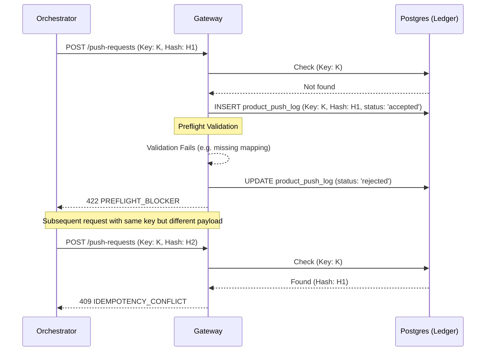
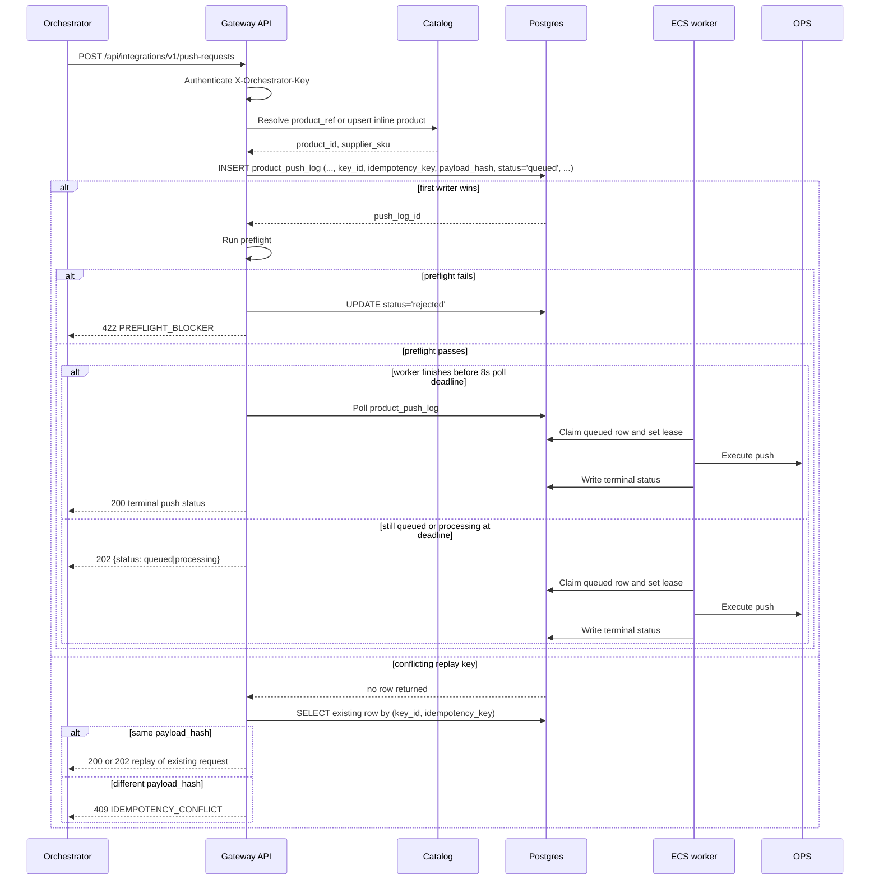

# API-HUB Integration Gateway — Design Spec

**Date:** 2026-05-11
**Owner:** Tanishq (PM/Tech Lead)
**Status:** Draft Rev 3 — Codex review rejected 2 of 5 Rev 2 fixes (P1.3, P2.4) and flagged 3 nits; Rev 3 corrects all five; pending team review
**Supersedes:** [`2026-05-08-sanmar-ops-staging-push-design.md`](2026-05-08-sanmar-ops-staging-push-design.md) (VPCE approach — could not run on current code state)
**Research backing:** [`.omc/research/research-20260511-pushgateway-142234/report.md`](../../../.omc/research/research-20260511-pushgateway-142234/report.md)
**Advisor input:** CCG (Codex + Gemini) artifacts under `.omc/artifacts/ask/`

> ⚠️ **Read order is bottom-up.** Start with [Revision 3 — Codex corrections](#revision-3--codex-corrections) FIRST (it overrides Rev 2 on P1.3 + P2.4 and adds nits for P1.1/P1.2/P2.5). Then [Revision 2 — P2 fixes + DX](#revision-2--p2-fixes--dx-cross-check). Then [Revision 1 — CCG critical fixes](#revision-1--critical-fixes-applied). Body below is the original Rev 0 draft. Once team approves Rev 3, all three revision appendices will be merged inline and this notice removed.

---

## Goal

Replace the n8n-coupled push pipeline with an **orchestrator-agnostic Integration Gateway**: a small set of secure HTTP endpoints that any external system (n8n, Zapier, Lambda, cron+bash, in-house worker) can call to push products from API-HUB to a customer's OPS storefront.

The backend will have **zero knowledge of n8n** after this lands. n8n becomes one possible consumer; the workflows + custom node stay in the repo but are no longer coupled to backend code.

## Why the prior VPCE spec failed

The 2026-05-08 spec assumed:
- `base_price` populated by the normalizer → it isn't (Bug 1, spike-confirmed)
- Inventory v200 SOAP wired into hydrate_product → it isn't (Bug 2)
- Markup engine applied in push path → it isn't (Bug 3)
- `merge.py` is the right place for the payload builder → it isn't (n8n-shaped, no markup, no validation)
- `service.py::push_product` is the right place to extend → it isn't (still POSTs creds in webhook body)

Net: VPCE preview/execute on top of broken inputs produces a working API surface that ships broken OPS records. Spec D was technically correct but rested on an unproven foundation.

## What this spec keeps from VPCE

- Halt-no-rollback on partial failure
- Per-step OPS target IDs captured for manual cleanup
- High operator visibility (push_log + admin UI)
- No bulk push for beta (single-product gateway request)
- Forward SanMar image URLs as-is (no rehost)
- Global 50% markup rule for VG OPS staging customer
- Manual master-options seed acceptable

## What this spec changes

- **Approach** — Gateway endpoints (not Preview/Execute pair). Idempotency-key + payload-hash semantics replace `preview_id` + `confirm_token`.
- **Auth** — Scoped API key per orchestrator (`X-Orchestrator-Key`) for beta; HMAC signature for V2. JWT cookie auth stays for admin UI only.
- **Scope** — Backend owns OPS push directly. n8n no longer in the push path. `trigger_n8n_push()` + `N8N_PUSH_WEBHOOK_URL` deleted.
- **Schema** — `ProductIngest` is the canonical product contract for both ingest and push (validated across PC61 / K500 / Decals #131 — research stage 4).

---

## Architecture

### API surface (4 endpoints, all under `/api/integrations/v1/`)

| Method | Path | Purpose | Auth |
|---|---|---|---|
| `POST` | `/suppliers/{supplier_slug}/products` | Catalog upsert (any orchestrator) | `X-Orchestrator-Key` |
| `GET`  | `/suppliers/{supplier_slug}/schema`   | Discover required + optional fields | `X-Orchestrator-Key` |
| `POST` | `/push-requests` | Ask API-HUB to push one product to one customer's OPS | `X-Orchestrator-Key` |
| `GET`  | `/push-requests/{push_log_id}` | Poll push status | `X-Orchestrator-Key` |

Plus optional outbound:
- `POST {callback.url}` — fire-and-forget `push.completed` event (orchestrator-provided URL)

### Pipeline (push)

```
[orchestrator]  POST /api/integrations/v1/push-requests
                  ├─ X-Orchestrator-Key + Idempotency-Key headers
                  ├─ body: { target, source, product_ref|product, decorations, dry_run, callback }
                  │
[api-hub]       ├─ Verify key → 401/403 on bad/scoped
                ├─ Check Idempotency-Key ledger
                │   ├─ same key + same payload_hash → return existing push_log_id (200)
                │   └─ same key + different hash → 409 IDEMPOTENCY_CONFLICT
                ├─ Resolve customer + supplier from DB (never from request body)
                ├─ Resolve product:
                │   ├─ product_ref → load from catalog
                │   └─ product → upsert into catalog (same as POST /suppliers/{slug}/products)
                ├─ Preflight validation (decorations ready, master-options mapped, prices set, images present)
                │   └─ blockers → 422 PREFLIGHT_BLOCKER + cleanup_targets=[]
                ├─ Insert push_log row, status=accepted, payload_hash, idempotency_key
                ├─ dry_run=true
                │   ├─ FakeOpsClient (in-memory) executes mutation plan
                │   ├─ status=dry_run_pushed
                │   └─ 202 + {push_log_id, plan}
                ├─ dry_run=false
                │   ├─ status=processing
                │   ├─ Resolve OPS creds from customer.ops_auth_config (EncryptedJSON)
                │   ├─ execute_push() → OPS GraphQL via existing ops_inbound/ops_client.py
                │   │   ├─ success → push_mappings upsert, status=pushed, ops_product_id set
                │   │   ├─ partial → status=partial_failure, cleanup_targets=[…]
                │   │   └─ failure → status=failed, error=…, cleanup_targets=[…]
                │   └─ 202 + {push_log_id}
                └─ async fire callback if callback.url present
                       └─ retry exponential backoff up to N attempts
                          callback_status independent of push status

[orchestrator]  GET /api/integrations/v1/push-requests/{push_log_id}
                  → poll until terminal state
```

### Async path

| Variant count | Mode |
|---|---|
| ≤ 20 | Synchronous request/response within the POST |
| > 20 | 202 immediately, `BackgroundTask(execute_push)` writes to `step_results JSONB` |

`sync_jobs` table is NOT used for push tracking — reserved for inbound supplier sync.

### Auth model

**Beta: scoped API key**

`integration_keys` table (single source of truth):

```sql
CREATE TABLE integration_keys (
    id VARCHAR(64) PRIMARY KEY,            -- human-readable: "n8n-vidhi-staging"
    key_hash VARCHAR(128) NOT NULL,        -- SHA-256 of raw key (raw key shown ONCE on creation)
    name VARCHAR(255) NOT NULL,
    allowed_customer_ids UUID[],           -- null = all
    allowed_supplier_slugs VARCHAR[],      -- null = all
    rate_limit_per_minute INT DEFAULT 60,
    is_active BOOLEAN DEFAULT TRUE,
    last_used_at TIMESTAMPTZ,
    created_at TIMESTAMPTZ DEFAULT NOW(),
    revoked_at TIMESTAMPTZ
);
```

Headers required on every gateway request:
```
X-Orchestrator-Key: <raw key>
Idempotency-Key: <orchestrator-chosen unique string, ≤128 chars>
Content-Type: application/json
```

**V2 upgrade path** — add `signing_secret VARCHAR(128)` column. When set, key requires HMAC signature in addition to raw header:
```
X-ApiHub-Timestamp: <unix-seconds>
X-ApiHub-Signature: v1=<hex(hmac_sha256(signing_secret, signing_string))>
```
Signing string: `{timestamp}\n{idempotency_key}\n{method}\n{path}\n{sha256(raw_body)}`. Timestamp skew > 300s → 401. Feature-flag the check by per-key column presence.

### Database changes

#### New table: `integration_keys` (above)

#### Expand `product_push_log` (+11 columns, all nullable, additive migration):

```sql
ALTER TABLE product_push_log
    ADD COLUMN request_id UUID UNIQUE,
    ADD COLUMN key_id VARCHAR(64),
    ADD COLUMN payload_hash VARCHAR(64),
    ADD COLUMN supplier_slug VARCHAR(64),
    ADD COLUMN supplier_sku VARCHAR(255),
    ADD COLUMN callback_url TEXT,
    ADD COLUMN callback_status VARCHAR(32) DEFAULT 'not_requested',
    ADD COLUMN callback_attempts INT DEFAULT 0,
    ADD COLUMN step_results JSONB,
    ADD COLUMN cleanup_targets JSONB,
    ADD COLUMN retry_of UUID;

ALTER TABLE product_push_log
    ALTER COLUMN status TYPE VARCHAR(32);  -- widen for new vocab
```

#### Status vocabulary (locked)

`product_push_log.status`:
| Value | Meaning |
|---|---|
| `accepted` | Request received, payload hash recorded, preflight pending |
| `queued` | Preflight passed, awaiting execution (async path only) |
| `processing` | Sync path: actively calling OPS |
| `pushed` | OPS confirmed product created/updated; push_mappings written |
| `failed` | Hard failure before any OPS writes; nothing to clean up |
| `partial_failure` | Some OPS steps succeeded; cleanup_targets populated |
| `rejected` | Preflight blocker (caller error); cleanup_targets empty |
| `canceled` | Operator-initiated cancel before terminal state |
| `dry_run_pushed` | dry_run=true ran cleanly through FakeOpsClient |

`product_push_log.callback_status`:
| Value | Meaning |
|---|---|
| `not_requested` | callback.url was null |
| `pending` | callback not yet attempted |
| `sent` | callback returned 2xx |
| `failed` | callback exhausted retries |

#### Extend `VariantIngest` schema (non-breaking)

```python
class VariantIngest(BaseModel):
    # ... existing fields ...
    sort_order: int = Field(
        default=0,
        description=(
            "Display sort order in OPS configurator. Populated from supplier "
            "size_index (SanMar PromoStandards) or equivalent supplier hint."
        ),
    )
```

Backfilled from SanMar `PSProductData.parts[].size_index` in `ps_normalizer_v2.py`. Default 0 preserves existing behaviour for products without sort hints.

---

## Payload schemas

### Push request envelope

```json
POST /api/integrations/v1/push-requests
X-Orchestrator-Key: oh-vidhi-staging-9f3a
Idempotency-Key: sm-pc61-vg-20260511-001
Content-Type: application/json

{
  "target":     { "system": "ops", "customer_id": "11111111-1111-1111-1111-111111111111" },
  "source":     { "supplier_slug": "sanmar" },
  "product_ref": { "supplier_sku": "PC61" },
  "product":    null,
  "decorations": [
    { "placement": "Front", "method": "DTG", "price_addition": "5.00" }
  ],
  "dry_run": false,
  "callback": {
    "url": "https://n8n.example.com/webhook/api-hub-push-complete",
    "secret": "optional-shared-secret-for-callback-hmac"
  }
}
```

- `product_ref` only → push already-ingested product
- `product` inline (ProductIngest shape) → upsert + push in one shot
- `decorations` lives OUTSIDE `product` — per-push customer concern, not catalog data
- `callback` optional; absence = no outbound webhook

### Catalog ingest envelope (orchestrator → hub)

```json
POST /api/integrations/v1/suppliers/sanmar/products
X-Orchestrator-Key: oh-vidhi-staging-9f3a
Idempotency-Key: sanmar-bulk-20260511-1430
Content-Type: application/json

{
  "mode": "upsert",
  "items": [ /* ProductIngest[] */ ]
}
```

### Concrete product examples (validated against `ProductIngest`)

#### SanMar PC61 (apparel + variants + decoration)

```json
{
  "supplier_sku": "PC61",
  "product_name": "Port & Company Essential Tee",
  "brand": "Port & Company",
  "description": "A customer favorite, this value-priced tee hits the mark on quality and comfort.",
  "product_type": "apparel",
  "category_name": "T-Shirts",
  "image_url": "https://www.sanmar.com/imgindex/PC61_NAVY_front.jpg",
  "apparel_details": { "pricing_method": "tiered_variant" },
  "variants": [
    {
      "part_id": "PC61-NAV-S", "sku": "PC61-NAV-S",
      "color": "Navy", "size": "S", "sort_order": 1,
      "base_price": "3.99", "inventory": 250, "warehouse": "GA",
      "prices": [{ "price_type": "Net", "quantity_min": 1, "price": "3.99" }]
    },
    {
      "part_id": "PC61-NAV-M", "sku": "PC61-NAV-M",
      "color": "Navy", "size": "M", "sort_order": 2,
      "base_price": "3.99", "inventory": 500, "warehouse": "GA",
      "prices": [{ "price_type": "Net", "quantity_min": 1, "price": "3.99" }]
    }
  ],
  "images": [
    { "url": "https://www.sanmar.com/imgindex/PC61_NAVY_front.jpg", "image_type": "front", "color": "Navy", "sort_order": 0 }
  ],
  "raw_payload": { "gtin": "0093456789012", "case_size": 72 }
}
```

#### SanMar K500 (tiered pricing 4 breaks)

```json
{
  "supplier_sku": "K500",
  "product_name": "Port Authority Silk Touch Polo",
  "product_type": "apparel",
  "apparel_details": { "pricing_method": "tiered_variant" },
  "variants": [
    {
      "part_id": "K500-BLK-S", "sku": "K500-BLK-S",
      "color": "Black", "size": "S", "sort_order": 1,
      "base_price": "12.99", "inventory": 100,
      "prices": [
        { "price_type": "Net", "quantity_min": 1,  "quantity_max": 11,   "price": "12.99" },
        { "price_type": "Net", "quantity_min": 12, "quantity_max": 23,   "price": "11.49" },
        { "price_type": "Net", "quantity_min": 24, "quantity_max": 47,   "price": "10.99" },
        { "price_type": "Net", "quantity_min": 48, "quantity_max": null, "price": "9.99"  }
      ]
    }
  ]
}
```

#### OPS Decals #131 (print + options + sizes)

```json
{
  "supplier_sku": "131",
  "ops_product_id": "131",
  "product_name": "Decals - General Performance",
  "product_type": "print",
  "external_catalogue": 1,
  "print_details": {
    "pricing_method": "formula",
    "ops_product_id_int": 131,
    "default_category_id": 22,
    "external_catalogue": 1
  },
  "sizes": [
    { "width": "0", "height": "0", "unit": "in", "label": "Custom Size", "ops_size_id": 1, "size_title": "Custom Size" },
    { "width": "4", "height": "4", "unit": "in", "label": "4\" x 4\"",    "ops_size_id": 2, "size_title": "4\" x 4\"" }
  ],
  "images": [
    { "url": "https://cdn.ops.test/decals/131_large.jpg", "image_type": "front", "sort_order": 0 }
  ],
  "options": [
    {
      "master_option_id": 59, "option_key": "lamMaterial",
      "title": "Lamination Material", "options_type": "combo", "required": false,
      "attributes": [
        { "title": "Gloss", "attribute_key": "gloss", "ops_attribute_id": 101, "master_attribute_id": 201, "setup_cost": "0.00", "multiplier": "1.00" },
        { "title": "Matte", "attribute_key": "matte", "ops_attribute_id": 102, "master_attribute_id": 202, "setup_cost": "0.00", "multiplier": "1.10" }
      ]
    }
  ]
}
```

### Response shapes

#### Push request 202 (accepted)

```json
{
  "push_log_id": "uuid",
  "status": "accepted",
  "customer_id": "uuid",
  "supplier_slug": "sanmar",
  "supplier_sku": "PC61",
  "ops_product_id": null,
  "dry_run": false,
  "callback_status": "pending",
  "created_at": "2026-05-11T10:00:00Z",
  "links": {
    "self": "/api/integrations/v1/push-requests/{push_log_id}"
  }
}
```

#### Push request terminal (GET status)

```json
{
  "push_log_id": "uuid",
  "status": "pushed",
  "customer_id": "uuid",
  "supplier_slug": "sanmar",
  "supplier_sku": "PC61",
  "ops_product_id": "12345",
  "mapping_id": "uuid",
  "error": null,
  "step_results": [
    { "step": "validate", "ok": true },
    { "step": "ops_create_product", "ok": true, "ops_id": "12345" },
    { "step": "ops_attach_options", "ok": true }
  ],
  "cleanup_targets": [],
  "callback_status": "sent",
  "callback_attempts": 1,
  "finished_at": "2026-05-11T10:00:42Z"
}
```

#### Callback (push.completed)

```json
POST {callback.url}
Content-Type: application/json
X-ApiHub-Event: push.completed

{
  "event": "push.completed",
  "push_log_id": "uuid",
  "idempotency_key": "sm-pc61-vg-20260511-001",
  "status": "pushed",
  "customer_id": "uuid",
  "supplier_slug": "sanmar",
  "supplier_sku": "PC61",
  "ops_product_id": "12345",
  "mapping_id": "uuid",
  "error": null,
  "finished_at": "2026-05-11T10:00:42Z"
}
```

If callback returns non-2xx: `callback_status` flips to `failed`, retry with exponential backoff (max 5 attempts). Orchestrator can still poll the status endpoint.

### Error envelope

```json
{
  "status": "error",
  "code": "PREFLIGHT_BLOCKER",
  "message": "Payload missing mandatory OPS mapping for 'Laminate'.",
  "details": {
    "field": "product.options[1].ops_master_attribute_id",
    "suggestion": "Run /api/push-mappings/resolve to find the missing ID."
  },
  "trace_id": "push_log_uuid"
}
```

Error codes:
| Code | HTTP | Meaning |
|---|---|---|
| `BAD_SIGNATURE` | 401 | Invalid `X-Orchestrator-Key` |
| `KEY_NOT_ALLOWED` | 403 | Key scoped away from this customer/supplier |
| `KEY_REVOKED` | 403 | `integration_keys.revoked_at` set |
| `UNKNOWN_REF` | 404 | Customer or product ref not found |
| `IDEMPOTENCY_CONFLICT` | 409 | Same key + different payload |
| `IN_FLIGHT` | 409 | Another push for same (customer, product) is `processing` |
| `PREFLIGHT_BLOCKER` | 422 | Payload validation failed (with details) |
| `RATE_LIMITED` | 429 | Key exceeded `rate_limit_per_minute` |
| `OPS_UPSTREAM_ERROR` | 502 | OPS GraphQL returned an error |

---

## Migration phases (strict order)

| Phase | Action | Admin route safe? |
|---|---|---|
| **M0** | Spike-bug fixes (Bugs 1+2 already in PR #104; Bug 3 absorbed by M1's payload_builder). Alembic additive migration: +11 columns on `product_push_log`, create `integration_keys` table, add `VariantIngest.sort_order` field. | YES (additive only) |
| **M1** | Write `prepare_push_intent()` + `execute_push()` + `build_push_payload()` + `OPSPushPayload` Pydantic model alongside existing code. New files only; no deletions yet. Bug 3 fix lives inside `build_push_payload()`. | YES |
| **M2** | Create `backend/modules/integrations/` module: `routes.py` (4 endpoints), `auth.py` (`X-Orchestrator-Key` dependency), `schemas.py` (request/response envelopes), `service.py` (gateway shim). Register in `main.py`. | YES |
| **M3** | Rewire `POST /api/push/{cid}/{pid}` admin route's internal call chain from `push_product()` → `prepare_push_intent()` + `execute_push()`. Response shape preserved. Verify with admin UI smoke test before continuing. | RISK — must verify before M4 |
| **M4** | Delete `trigger_n8n_push()`, body of old `push_product()`, `N8N_PUSH_WEBHOOK_URL` env var, `merge.py`, `ops_auth` dict in webhook body, `modules/n8n_proxy/` (entire module — 172 LOC), `N8N_*` env entries from `main.py::_PROD_REQUIRED_ENV_VARS`. | YES (only after M3 verified) |
| **M5** | Delete `GET /api/push/image/{id}/processed` once `execute_push()` owns image upload internally. May be deferred. | YES (when ready) |

**Critical rule:** M4 must NEVER precede M3. Verified by integration test gate before M4 PR can merge.

---

## What changes outside the backend

### Frontend (admin UI)

- New page: `/integrations/keys` — `vg_admin` CRUD for `integration_keys` (create, revoke, view scope, view last_used_at)
- Existing push button on `customers/{id}/catalog` keeps working — admin route URL unchanged
- New panel on push log detail: shows orchestrator key id, idempotency key, payload hash, callback status, step_results, cleanup_targets

### n8n (no longer in backend, but workflow JSONs stay in repo)

- Existing `vg-ops-push-001` workflow becomes obsolete — backend now owns the OPS GraphQL call
- New optional `n8n-workflows/api-hub-orchestrator.example.json` workflow showing how n8n calls the new gateway (`HTTP Request → POST /api/integrations/v1/push-requests` with `X-Orchestrator-Key` header from n8n env)
- Existing inbound sync workflows (catalog pulls, master-options sync) unchanged — they continue to use `INGEST_SHARED_SECRET` on `/api/ingest/*` routes (back-compat preserved)

### Documentation

- New `docs/integrations/README.md` — orchestrator-author onboarding (5-minute from zero to first push)
- New `docs/integrations/openapi.yaml` — formal API spec
- New `docs/integrations/error-codes.md` — table of all error codes + retry strategy per code
- `docs/n8n-integration.md` — updated to point at gateway endpoints (n8n becomes one consumer, not the only one)

---

## Risks

| Risk | Mitigation |
|---|---|
| **Secret distribution at scale** | Per-orchestrator `key_id` shown once at creation; key_hash stored. Rotation = generate new key, revoke old (no shared secret). |
| **Replay attacks (beta, no HMAC)** | TLS-only + short idempotency window (24h ledger) + per-key revocation. Acceptable for beta with trusted orchestrators. |
| **Partial OPS write on failure** | Halt-no-rollback (no auto-cleanup). `cleanup_targets JSONB` records OPS IDs created so operator can manually delete. UI surfaces red banner with checklist. |
| **Retry storms** | Server-side exponential backoff on outbound callbacks (max 5 attempts). No auto-trigger of new push from callbacks. Per-key `rate_limit_per_minute`. |
| **Multi-tenant isolation** | `allowed_customer_ids[]` + `allowed_supplier_slugs[]` per key. Server rejects 403 if request target is out of scope. |
| **Callback SSRF** | Per-key `allowed_callback_hosts[]` allowlist (optional column, can be added later); reject `callback.url` not matching. For beta: any URL allowed, document as risk. |
| **Bug 3 (markup bypass) regression** | Markup engine call lives inside `build_push_payload()` (M1). Unit test on the builder asserts `final_price = base_price * (1 + markup_rate)`. CI gate. |
| **Image-route deletion premature** | `GET /api/push/image/{id}/processed` (M5) is deferred and gated by frontend confirmation that the route is no longer load-bearing. |

---

## Out of scope (explicit, deferred to later phases)

- Bulk push (multi-product in one request) — re-enables post-beta after gateway stabilizes
- Image rehost / CDN — Phase 11
- Scheduled push retries — Phase 9
- Multi-tenant RBAC beyond admin / customer_admin — Phase 12 (already done)
- OTel / Sentry observability — Phase 13
- Per-supplier OPS rate limiting — Phase 9
- HMAC v2 auth — flagged in spec, but implementation deferred until beta proves API key sufficiency
- OPS GraphQL mutation gap (33 mutations missing per `OPS-NODE-GAP-ANALYSIS.md`) — separate workstream, blocks `execute_push` completeness but not the gateway shape

---

## Spike-script bug status (research-confirmed)

| Bug | Status | Where it's fixed in this spec |
|---|---|---|
| 1. `base_price=None` on V2 normalizer | Fixed in PR #104 | Prerequisite — must merge before M1 |
| 2. Inventory v200 SOAP not called | Fixed in PR #104 | Prerequisite — must merge before M1 |
| 3. Markup engine bypassed by push | Fixed by M1's `build_push_payload()` | Inside M1 implementation (no separate patch) |
| 4. VG customer OAuth2 flow | Passing per spike | No action |

---

## Acceptance criteria

Spec is implemented when:

- [ ] PR #104 (spike bugs 1+2) merged into main
- [ ] M0 migration applied: `integration_keys` exists, 11 columns on `product_push_log`, `VariantIngest.sort_order` field present
- [ ] M1 functions exist and unit-tested: `prepare_push_intent`, `execute_push`, `build_push_payload`, `OPSPushPayload`
- [ ] M2: 4 gateway endpoints serve curl tests with `X-Orchestrator-Key` auth
- [ ] M3: admin route end-to-end smoke test passes; existing push button works unchanged
- [ ] M4: `grep -rn "n8n" backend/modules/` returns 0 functional refs (docstrings/comments OK)
- [ ] Contract tests pass:
  - send once → 202
  - send same key+body → 200 same `push_log_id`
  - send same key + different body → 409 `IDEMPOTENCY_CONFLICT`
  - send key out of customer scope → 403 `KEY_NOT_ALLOWED`
  - send invalid key → 401 `BAD_SIGNATURE`
  - `dry_run=true` returns plan, no OPS writes
  - `dry_run=false` happy path → status=pushed + push_mappings row + callback fired
  - OPS error → status=failed, error populated, no push_mappings row
- [ ] Single SanMar PC61 product pushed to VG OPS staging end-to-end via curl + orchestrator-key (no n8n in path) with correct markup, decoration, images, inventory

---

## Open questions for team

1. **API key column naming on Supplier model** — `n8n_credential_id` should be renamed `ops_credential_id` after M4 (it represents OPS OAuth creds, not n8n-specific). Acceptable to rename in M4 PR or separate cosmetic PR?
2. **Callback signing** — beta accepts optional `callback.secret` for orchestrator to verify caller is API-HUB. HMAC-SHA256 on the request body, header `X-ApiHub-Callback-Signature`. Confirm shape before M2.
3. **Image route retention** — does `GET /api/push/image/{id}/processed` still serve the admin UI? If yes, defer M5 indefinitely.
4. **Bulk push reintroduction** — when does multi-product gateway request come back? Spec defers but should document target phase.
5. **Rate limiting backing store** — `rate_limit_per_minute` per key needs either Redis or an in-Postgres counter. Beta acceptable to skip enforcement and just log?

---

## References

- Research report: `.omc/research/research-20260511-pushgateway-142234/report.md`
- Codex advisor artifact: `.omc/artifacts/ask/codex-task-brainstorm-a-dynamic-n8n-agnostic-webhook-rest-api-desi-2026-05-11T07-55-36-137Z.md`
- Gemini advisor artifact: `.omc/artifacts/ask/gemini-task-brainstorm-developer-experience-and-integration-contrac-2026-05-11T07-49-24-950Z.md`
- Stage 1 (ops_push audit): `.omc/research/research-20260511-pushgateway-142234/stages/stage-1.md`
- Stage 2 (spike bugs decode): `.omc/research/research-20260511-pushgateway-142234/stages/stage-2.md`
- Stage 3 (n8n reference map, 311 LOC): `.omc/research/research-20260511-pushgateway-142234/stages/stage-3.md`
- Stage 4 (ProductIngest fit): `.omc/research/research-20260511-pushgateway-142234/stages/stage-4.md`
- Superseded VPCE spec: `docs/superpowers/specs/2026-05-08-sanmar-ops-staging-push-design.md`
- PR #104 (spike bugs 1+2 fix): https://github.com/VisualGraphxLLC/API-HUB/pull/104

---

# Revision 1 — Critical fixes applied

> Generated 2026-05-11 from CCG critique (Codex + Gemini) and 4 parallel codex-team workers.
> Each subsection patches specific line ranges of the body above. Where this section conflicts with the body, **Revision 1 wins.**
>
> Source drafts live in `.omc/drafts/spec-revisions/wN[0-3]-*.md`.

---


<!-- ===== from wN0-schema-and-ingest.md ===== -->

# API-HUB Integration Gateway spec revision draft

Applies to [`docs/superpowers/specs/2026-05-11-integration-gateway-design.md`](/Users/tanishq/Documents/project-files/api-hub/api-hub/docs/superpowers/specs/2026-05-11-integration-gateway-design.md).

## Replace lines 41-45

- **Approach** — Gateway endpoints (not Preview/Execute pair). `Idempotency-Key` is persisted separately from a server-generated `request_id`; replay semantics are keyed by `(key_id, idempotency_key, payload_hash)`, never by `request_id`.
- **Auth** — Scoped API key per orchestrator (`X-Orchestrator-Key`) for beta; HMAC signature for V2. JWT cookie auth stays for admin UI only.
- **Scope** — Backend owns OPS push directly. n8n no longer in the push path. `trigger_n8n_push()` + `N8N_PUSH_WEBHOOK_URL` deleted.
- **Schema** — `ProductIngest` remains the canonical external contract for both ingest and push, but M0 MUST close the current DB persistence gaps so a `ProductIngest` persisted to catalog storage can be rehydrated back into the same contract without field loss. Until M0 lands, that claim is aspirational rather than true.

## Insert after line 142

### Idempotency semantics (locked)

For V1, strict server-side idempotency applies to `POST /api/integrations/v1/push-requests`.

- `request_id UUID` is a server-generated correlation id for tracing and retries. It is never populated from the `Idempotency-Key` header and it is never used as the replay key.
- `idempotency_key VARCHAR(128)` stores the raw `Idempotency-Key` header exactly as received.
- The replay ledger is scoped to `(key_id, idempotency_key)`, so two different orchestrator keys may reuse the same header value without colliding.
- `payload_hash` is the lowercase hex SHA-256 of the canonical request JSON. Compute it exactly as follows:
1. Parse the raw request body as JSON.
2. Recursively remove object members whose value is `null`.
3. Preserve array order exactly; do not remove array elements, including `null` elements.
4. Serialize the resulting value using RFC 8785 JSON Canonicalization Scheme rules: UTF-8, lexicographically sorted object keys, RFC 8785 number formatting, and no insignificant whitespace.
5. Compute SHA-256 over the UTF-8 bytes of that canonical serialization and encode the digest as lowercase hex.

`POST /push-requests` behavior is locked:

| Condition | Result |
|---|---|
| First-seen `(key_id, idempotency_key)` | Create a new `product_push_log` row and continue normal processing |
| Same `(key_id, idempotency_key)` + same `payload_hash` | Return `200` with the existing `push_log_id`; do not enqueue OPS work again |
| Same `(key_id, idempotency_key)` + different `payload_hash` | Return `409 IDEMPOTENCY_CONFLICT` |

`product_push_log.id` remains the public `push_log_id`. `request_id` exists for tracing, retry linkage, and operator support only.

## Replace lines 148-166

#### Expand `product_push_log` (+12 columns, additive migration)

```sql
ALTER TABLE product_push_log
    ADD COLUMN request_id UUID NOT NULL DEFAULT gen_random_uuid(),
    ADD COLUMN key_id VARCHAR(64),
    ADD COLUMN idempotency_key VARCHAR(128),
    ADD COLUMN payload_hash CHAR(64),
    ADD COLUMN supplier_slug VARCHAR(64),
    ADD COLUMN supplier_sku VARCHAR(255),
    ADD COLUMN callback_url TEXT,
    ADD COLUMN callback_status VARCHAR(32) DEFAULT 'not_requested',
    ADD COLUMN callback_attempts INT DEFAULT 0,
    ADD COLUMN step_results JSONB,
    ADD COLUMN cleanup_targets JSONB,
    ADD COLUMN retry_of UUID;

ALTER TABLE product_push_log
    ALTER COLUMN status TYPE VARCHAR(32);

ALTER TABLE product_push_log
    ADD CONSTRAINT fk_product_push_log_key_id
    FOREIGN KEY (key_id) REFERENCES integration_keys(id) ON DELETE SET NULL;

CREATE UNIQUE INDEX uq_product_push_log_key_idempotency
    ON product_push_log (key_id, idempotency_key)
    WHERE key_id IS NOT NULL AND idempotency_key IS NOT NULL;

CREATE INDEX ix_product_push_log_payload_hash
    ON product_push_log (payload_hash);
```

`request_id` and `idempotency_key` are intentionally distinct. The header value must never be coerced into a UUID or stored in `request_id`.

## Replace lines 191-205

#### ProductIngest persistence closure (C3)

Decision: choose **(a) expand persistence**, not **(b) cut the canonical-contract claim**.

Rationale:
- The gateway accepts either `product_ref` or inline `product`, so push preflight, payload building, and catalog re-use are materially simpler if they operate on one contract shape.
- The missing fields are fixable with additive columns plus a small persistence rewrite; weakening the claim would create a second DTO and duplicate validation logic.

Current `ProductIngest` fields or behaviors that do **not** round-trip back from DB today:
- `ProductIngest.category_external_id` — no product-level storage; `category_id` alone cannot reliably reproduce the supplier-facing value.
- `ProductIngest.category_name` — stored as `products.category`, but current read shape exposes `category`, not `category_name`.
- `ProductIngest.raw_payload` — no column.
- `VariantIngest.part_id` — required in schema, but no DB column; `/inventory` and `/pricing` currently overload `sku` as the lookup key.
- `VariantIngest.sort_order` — proposed by this spec, but not persisted anywhere today.
- `ProductSizeIngest.ops_size_id` — no column.
- `ProductSizeIngest.size_title` — no column.
- `PrintDetailsIngest.ops_product_id_int` — no column.
- `PrintDetailsIngest.default_category_id` — no column.
- `PrintDetailsIngest.external_catalogue` — no column.
- `ImageIngest.supplier_image_url` — inserted on create, but not refreshed on conflict update.
- Snapshot semantics gap — `persist_product()` preserves omitted `variants`, `images`, and `options`, so re-ingesting a `ProductIngest` is merge-upsert, not exact contract replacement.

M0 schema additions required to make the canonical-contract claim true:
- `products.category_external_id VARCHAR(255) NULL`
- `products.raw_payload JSONB NULL`
- `product_variants.part_id VARCHAR(255) NULL` with backfill from existing `sku`
- `product_variants.sort_order INTEGER NOT NULL DEFAULT 0`
- `product_sizes.ops_size_id INTEGER NULL`
- `product_sizes.size_title VARCHAR(100) NULL`
- `print_details.ops_product_id_int INTEGER NULL`
- `print_details.default_category_id INTEGER NULL`
- `print_details.external_catalogue INTEGER NULL`

M0 persistence and hydrator fixes required in the same milestone:
- Write and read `product_variants.part_id` as the canonical supplier part identifier; keep `sku` as a separate optional field.
- Map `products.category` back to `ProductIngest.category_name` and `products.category_external_id` back to `ProductIngest.category_external_id` in the DB-to-contract hydrator.
- Persist `products.raw_payload`.
- Persist and read `VariantIngest.sort_order`, `ProductSizeIngest.ops_size_id`, `ProductSizeIngest.size_title`, and the three print-detail metadata fields.
- Update `ProductImage` upsert so `supplier_image_url` is included in the conflict-update set.
- Change `persist_product()` to snapshot semantics for `variants`, `images`, `options`, and `sizes`: missing child rows are deleted in the same transaction before reinsertion/upsert.
- Update `/api/ingest/{supplier_id}/inventory` and `/api/ingest/{supplier_id}/pricing` to target variants by `(product_id, part_id)`, not `(product_id, sku)`.

Alembic sketch for the new canonical-contract columns:

```python
op.add_column("products", sa.Column("category_external_id", sa.String(255), nullable=True))
op.add_column("products", sa.Column("raw_payload", postgresql.JSONB(astext_type=sa.Text()), nullable=True))
op.add_column("product_variants", sa.Column("part_id", sa.String(255), nullable=True))
op.add_column("product_variants", sa.Column("sort_order", sa.Integer(), nullable=False, server_default="0"))
op.execute("UPDATE product_variants SET part_id = sku WHERE part_id IS NULL")
op.create_unique_constraint("uq_product_variants_product_part_id", "product_variants", ["product_id", "part_id"])
op.add_column("product_sizes", sa.Column("ops_size_id", sa.Integer(), nullable=True))
op.add_column("product_sizes", sa.Column("size_title", sa.String(100), nullable=True))
op.add_column("print_details", sa.Column("ops_product_id_int", sa.Integer(), nullable=True))
op.add_column("print_details", sa.Column("default_category_id", sa.Integer(), nullable=True))
op.add_column("print_details", sa.Column("external_catalogue", sa.Integer(), nullable=True))
```

## Replace line 451

| **M0** | Additive Alembic migration: create `integration_keys`; expand `product_push_log` with distinct `request_id` and `idempotency_key` ledger fields; expand `products`, `product_variants`, `product_sizes`, and `print_details` so `ProductIngest` can round-trip losslessly; update catalog persistence to snapshot semantics; add contract tests for idempotent replay and DB rehydration fidelity. | YES (additive only) |

## Replace lines 529 and 534-537

- [ ] M0 migration applied: `integration_keys` exists; `product_push_log` has `request_id`, `idempotency_key`, `payload_hash`, and unique `(key_id, idempotency_key)` replay protection; `products`, `product_variants`, `product_sizes`, and `print_details` carry the canonical-contract gap-closure columns.
- [ ] Round-trip contract tests pass: persist `ProductIngest` -> read from DB -> rehydrate `ProductIngest` with no loss of `category_external_id`, `category_name`, `raw_payload`, `part_id`, `sort_order`, size metadata, or print metadata.
- [ ] Contract tests pass for the locked idempotency cases: first send -> `202`; same `X-Orchestrator-Key` + same `Idempotency-Key` + canonically equivalent body -> `200` with the same `push_log_id`; same `X-Orchestrator-Key` + same `Idempotency-Key` + canonically different body -> `409 IDEMPOTENCY_CONFLICT`.


---

<!-- ===== from wN1-ops-auth-and-mutations.md ===== -->

## OPS auth flow and outbound mutation contract

_Replace spec lines 84-90, 109-142, and 509 with this section. This also narrows line 35's "Forward SanMar image URLs as-is" promise to one primary product image in beta until a product-gallery write contract is verified._

Grounding:
- `Customer` already stores `ops_base_url`, `ops_token_url`, and `ops_client_id` as top-level columns; only `client_secret` lives in `ops_auth_config` (`backend/modules/customers/models.py:10-19`, `backend/modules/customers/routes.py:137-147`).
- `OPSClient` accepts a bearer token, not raw OAuth client credentials (`backend/modules/ops_inbound/ops_client.py:15-42`).
- The existing spike script already exercises the intended OAuth2 `client_credentials` grant and prints preview `setProduct` and `setProductPrice` calls (`backend/scripts/sanmar_ops_spike.py:163-259`).
- Current OPS wrappers in-repo expose `setProduct`, `setProductSize`, `setProductPrice`, `setAssignOptions`, `setAdditionalOption`, `setAdditionalOptionAttributes`, `setProductsAttributePrice`, and `updateProductStock`; the documented image mutations are order-product image mutations, not a verified catalog-product gallery mutation (`n8n-nodes-onprintshop/nodes/OnPrintShop.node.ts:965-992, 1305-1313, 1488-1561, 6584-6892`, `n8n-nodes-onprintshop/OPS-NODE-GAP-ANALYSIS.md:65-68,105-124`).
- `OPSProductInput` already admits both `products_id` and `products_image`, so "create" vs "update" must be modeled as one `setProduct` mutation with different inputs, not as fictional `createProduct` and `updateProduct` mutation names (`n8n-nodes-onprintshop/nodes/OnPrintShop/types.ts:1-9`).
- API-HUB already has a product-scoped option projection with source trace fields for OPS mapping recovery (`backend/modules/markup/routes.py:81-154`, `backend/tests/test_ops_options_endpoint.py:30-128`).

### OPS credential resolution and token cache

1. Load the target customer row and read:
   - `customers.ops_base_url`
   - `customers.ops_token_url`
   - `customers.ops_client_id`
   - `customers.ops_auth_config.client_secret`
2. If any field is missing, fail preflight with `PREFLIGHT_BLOCKER`; do not start any OPS mutation.
3. Mint a bearer token with `POST {ops_token_url}` using OAuth2 `client_credentials`, `application/x-www-form-urlencoded`, and the stored `client_id` plus `client_secret`.
4. Cache the minted token only in process memory, keyed by `(customer_id, ops_base_url, ops_client_id)`, with `expires_at = now + expires_in - 60s`. If `expires_in` is absent, default TTL is 300 seconds.
5. Instantiate `OPSClient(base_url=customer.ops_base_url, auth_token=<cached bearer>)` only after the cache returns a live token.
6. On a GraphQL `401` or `403`, evict the cached token, mint once more, and retry the failed mutation exactly once. A second auth failure is terminal: `OPS_AUTH_FAILED`.
7. Do not store minted bearer tokens in Postgres, `product_push_log`, `push_mappings`, or the `customers` row. Do not introduce Redis for beta.

Rationale:
- In-memory cache is enough for beta because a single push attempt targets one customer and the token can always be reminted from durable customer credentials.
- Redis adds new infrastructure for a short-lived secret.
- Postgres should not become a bearer-token store; it increases secret exposure and still does not help a resumed worker more than reminting does.

### PC61 outbound mutation sequence

#### Preflight gates

- Every pushed variant must have `sku`, a computed final price, and non-null inventory; otherwise return `422 PREFLIGHT_BLOCKER` before the first OPS write.
- The push mode must be chosen once per customer:
  - `master_option_attach`: all enabled options map to existing OPS master options and use `setAssignOptions`.
  - `product_local_option_create`: the customer explicitly accepts the beta additional-option mutations and uses `setAdditionalOption` plus children.
- Mixed option strategies inside one push request are forbidden.

#### Mutation order

1. Resolve create vs update mode.
   - If `push_mappings.target_ops_product_id` already exists for `(customer_id, source_product_id)`, run in update mode and include `products_id=<existing OPS product id>` in `setProduct`.
   - Otherwise run in create mode and omit `products_id` or send `0`.
2. Call `setProduct` first.
   - Required fields: customer-prefixed title, internal title/source SKU, category, visibility, description when present.
   - If a product image exists, send only the primary front image URL as `products_image`.
   - Capture returned `products_id` immediately and persist it before moving to child mutations.
3. Call `setProductSize` once per variant, in deterministic order `sort(color, size, sku)`.
   - Input must carry `products_id`, `size_name`, `color_name`, `products_sku`, and `product_size_id` when retrying or updating.
   - Persist each returned `product_size_id` in `step_results`.
4. Call `setProductPrice` after the size for that variant exists.
   - Beta contract: one visible price row per variant, `qty=1`, `qty_to=999999`.
   - `vendor_price` is the normalized source cost.
   - `price` is the marked-up customer sell price from API-HUB pricing.
   - `size_id` must be the `product_size_id` returned by the preceding size step.
5. Attach options after all sizes exist.
   - `master_option_attach` mode:
     - Call `setAssignOptions` once per enabled product option.
     - Input includes `products_id`, `master_option_id`, enabled `attribute_ids`, and any option-level setup cost.
   - `product_local_option_create` mode:
     - Call `setAdditionalOption` once per enabled product option.
     - Then call `setAdditionalOptionAttributes` once per enabled attribute for that option.
     - Then call `setProductsAttributePrice` for each created attribute that carries a non-zero option price.
   - In both modes, preserve API-HUB option order and attribute order from the product-scoped option payload; never rely on Python dict iteration order.
6. Call inventory last with `updateProductStock`.
   - Use `action=Reset`, not additive math, because API-HUB owns the absolute inventory number for the variant.
   - Prefer `product_sku=<variant sku>` as the stable identifier; include `stock_id` only when a prior successful response already recorded it.
   - `input.stock_quantity` is the exact supplier-derived on-hand quantity.

#### Image handling in beta

- Beta supports only the single primary product image carried on `setProduct.products_image`.
- Do not call `setOrderProductImage` for catalog pushes; the documented contract is for order products, not catalog products.
- Do not promise multi-image gallery sync until a product-scoped OPS image mutation is live-tested and added to this spec.

### Step-level recovery and partial-write contract

- `step_results` is append-only JSONB. Each successful step records:
  - `step`
  - `source_key` (`supplier_sku`, `variant sku`, `option_key`, `attribute_key`)
  - `mutation`
  - `request_fingerprint`
  - `ops_ids`
  - `attempted_at`
- `cleanup_targets` records every upstream identifier that may require manual cleanup:
  - `ops_product_id`
  - `product_size_ids[]`
  - `option_ids[]`
  - `attribute_ids[]`
  - `inventory_keys[]`
- Immediately after `setProduct` succeeds, upsert `push_mappings` with `status='partial'` and `target_ops_product_id=<products_id>`. Do not wait until the whole push is done, or retries will create duplicate products.
- As soon as option or attribute target IDs are known, upsert `push_mapping_options` rows using the existing `source_master_*`, `source_option_key`, and `source_attribute_key` fields.
- Size IDs have no dedicated mapping table today, so they must live in `step_results` until a separate variant-mapping table exists.
- Retry behavior:
  - If `ops_product_id` already exists, rerun `setProduct` in update mode instead of creating a second product.
  - If a prior `product_size_id` exists in `step_results`, pass it back into `setProductSize`.
  - `setProductPrice` and `updateProductStock` are overwrite steps and may be replayed safely.
  - Option and attribute create steps must never be repeated when a target ID is already recorded.
- Failure before the first successful OPS mutation sets `status=failed`.
- Failure after the first successful OPS mutation sets `status=partial_failure`, preserves `step_results` plus `cleanup_targets`, and requires manual operator review. Beta does not auto-delete partially created OPS records.


---

<!-- ===== from wN2-durable-execution.md ===== -->

## Durable execution revision for Integration Gateway

_Replace spec lines 79-105, 148-189, 350-362, 415, and 440 in `docs/superpowers/specs/2026-05-11-integration-gateway-design.md` with this section._

### Decision

Pick **Option (a): `product_push_log` as the durable queue, executed by a separate ECS Fargate worker service that polls Postgres and claims work with `FOR UPDATE SKIP LOCKED` plus a lease.**

Why this option:

| Option | Verdict | Reason |
|---|---|---|
| `(a)` Postgres queue + ECS worker | **Pick for beta** | No new managed AWS primitive beyond ECS + RDS already in use. Durable accepted state lives in Postgres. Keeps long OPS calls off the FastAPI request worker pool. |
| `(b)` SQS + ECS worker | Defer to V2 | Strong long-term shape, but adds queue/DLQ/IAM/alarms/message-contract work that is not justified for beta single-customer rollout. |
| `(c)` Sync-only beta | Reject | Simplest on paper, but a real OPS push for a single product can still be long-running and will tie up FastAPI workers and client/ALB timeouts. It removes lost-202 risk by removing 202, but does not fit the existing `>20 variants` contract well. |

Decision rationale by required axis:

- **Operational simplicity:** Option `(a)` avoids SQS/DLQ and reuses `product_push_log` as the durable source of truth. The only new runtime shape is a second ECS Fargate service/command for workers.
- **Recovery semantics:** Option `(a)` gives durable `queued` rows, worker lease expiry, and explicit reclaim. A process crash can no longer silently lose an accepted push or callback retry.
- **Latency:** Sync remains allowed only for small pushes. `>20 variants` no longer block FastAPI workers while OPS calls run.
- **Beta scope alignment:** Beta is still a single-product rollout, so Postgres-backed durable execution is enough. SQS is unnecessary, but sync-only is too fragile for long-running catalog writes.

### Replace the current request flow and async-path table with

`BackgroundTask(execute_push)` is forbidden for real pushes and callback retries.

New execution split:

| Variant count | Mode |
|---|---|
| `<= 20` | Synchronous request/response inside the POST. Row is inserted as `status='processing'`, then `execute_push()` runs inline. |
| `> 20` | Durable async. Row is inserted as `status='queued'`, POST returns `202`, and a separate ECS Fargate worker executes it later. |

Request contract:

1. Auth, idempotency lookup, catalog lookup, and preflight all run **before** the row is inserted.
2. If preflight fails, return `422 PREFLIGHT_BLOCKER`; do not create a queued row.
3. If the push is sync-sized, insert `product_push_log` with `status='processing'`. If the in-flight uniqueness constraint rejects the insert, return `409 IN_FLIGHT`.
4. If the push is async-sized, insert `product_push_log` with `status='queued'`, `callback_status='pending'` when `callback.url` is present, and return `202`.
5. The `202` response body should now return `"status": "queued"` instead of `"accepted"`. `accepted` remains an HTTP-level concept, not a persisted `product_push_log.status`.

Revised 202 example:

```json
{
  "push_log_id": "uuid",
  "status": "queued",
  "customer_id": "uuid",
  "supplier_slug": "sanmar",
  "supplier_sku": "PC61",
  "ops_product_id": null,
  "dry_run": false,
  "callback_status": "pending",
  "created_at": "2026-05-11T10:00:00Z",
  "links": {
    "self": "/api/integrations/v1/push-requests/{push_log_id}"
  }
}
```

### Replace the `product_push_log` additive migration and status vocab with

```sql
ALTER TABLE product_push_log
    ADD COLUMN request_id UUID UNIQUE,
    ADD COLUMN key_id VARCHAR(64),
    ADD COLUMN payload_hash VARCHAR(64),
    ADD COLUMN supplier_slug VARCHAR(64),
    ADD COLUMN supplier_sku VARCHAR(255),
    ADD COLUMN callback_url TEXT,
    ADD COLUMN callback_status VARCHAR(32) DEFAULT 'not_requested',
    ADD COLUMN callback_attempts INT NOT NULL DEFAULT 0,
    ADD COLUMN callback_next_attempt_at TIMESTAMPTZ,
    ADD COLUMN step_results JSONB,
    ADD COLUMN cleanup_targets JSONB,
    ADD COLUMN retry_of UUID,
    ADD COLUMN worker_id VARCHAR(128),
    ADD COLUMN lease_until TIMESTAMPTZ;

ALTER TABLE product_push_log
    ALTER COLUMN status TYPE VARCHAR(32);

CREATE UNIQUE INDEX IF NOT EXISTS uq_push_log_in_flight
  ON product_push_log (customer_id, product_id)
  WHERE status IN ('queued', 'processing');
```

Persisted `product_push_log.status` values:

| Value | Meaning |
|---|---|
| `queued` | Preflight passed; durable async row awaiting worker claim |
| `processing` | Push is actively executing, either inline or in worker |
| `pushed` | OPS confirmed product created/updated; mappings written |
| `failed` | Hard failure before any OPS writes; nothing to clean up |
| `partial_failure` | Some OPS steps succeeded; `cleanup_targets` populated |
| `rejected` | Preflight blocker or policy rejection; no OPS writes |
| `canceled` | Operator canceled before terminal state |
| `dry_run_pushed` | `dry_run=true` ran cleanly through `FakeOpsClient` |

`product_push_log.callback_status` values:

| Value | Meaning |
|---|---|
| `not_requested` | `callback.url` was null |
| `pending` | callback delivery is due now or scheduled for retry at `callback_next_attempt_at` |
| `sent` | callback returned `2xx` |
| `failed` | callback exhausted retries or violated callback policy |

### Worker lease, heartbeat, and reclaim contract

Worker deployment:

- Run a separate ECS Fargate service, e.g. `integration-gateway-worker`.
- Poll interval: **5 seconds**.
- Claim batch size: start with **1** for beta; raise later only after step-level idempotency is proven.

Claim algorithm for push execution:

```sql
WITH candidate AS (
    SELECT id
    FROM product_push_log
    WHERE status = 'queued'
      AND (lease_until IS NULL OR lease_until < NOW())
    ORDER BY pushed_at ASC
    FOR UPDATE SKIP LOCKED
    LIMIT 1
)
UPDATE product_push_log p
SET status = 'processing',
    worker_id = :worker_id,
    lease_until = NOW() + INTERVAL '90 seconds'
FROM candidate
WHERE p.id = candidate.id
RETURNING p.*;
```

Lease rules:

- Heartbeat interval: **30 seconds**.
- Each heartbeat sets `lease_until = NOW() + INTERVAL '90 seconds'` for the same `worker_id`.
- On terminal push status (`pushed`, `failed`, `partial_failure`, `rejected`, `canceled`), clear `worker_id` and `lease_until`.
- A row with `lease_until < NOW()` is reclaimable by another worker.

Resume rules after crash or scale-in:

1. Execution is **at-least-once**, not exactly-once.
2. After every successful upstream OPS mutation, the worker must durably write the returned IDs into `step_results`, `cleanup_targets`, and `push_mappings` **before** issuing the next mutation.
3. On lease reclaim, the new worker reloads `step_results`, `cleanup_targets`, `ops_product_id`, and any `push_mappings`, then resumes from the last durably recorded completed step.
4. If the last in-flight OPS call has an ambiguous outcome because the worker died after sending the request but before durably recording the result, the worker must do a read-after-write reconciliation when a safe lookup exists; otherwise mark `partial_failure` and stop for operator review. It must never silently drop the row.

Callback retries use the same durable worker model:

1. After a push reaches a terminal status, if `callback_status='pending'`, set `callback_next_attempt_at = NOW()`.
2. Workers also poll terminal rows where `callback_status='pending'` and `callback_next_attempt_at <= NOW()`.
3. Callback delivery is lease-protected with the same `worker_id` / `lease_until` contract; do not use in-process timers.
4. On non-`2xx`, increment `callback_attempts`, compute exponential backoff, and set `callback_next_attempt_at`.
5. After **5** failed attempts, set `callback_status='failed'`.

### Replace `IN_FLIGHT` semantics with

Use the **partial unique index**, not a row-level lock at insert time.

Why:

- The push must stay single-flight for the full lifetime of a queued or processing row, not just during the request transaction.
- A row-level lock released at commit cannot protect the later ECS worker execution window.
- The partial unique index gives one durable source of truth for both the synchronous and async paths.

`IN_FLIGHT` should now read:

| Code | HTTP | Meaning |
|---|---|---|
| `IN_FLIGHT` | 409 | Another push for the same `(customer_id, product_id)` is already `queued` or `processing` |


---

<!-- ===== from wN3-security-rollout-dx.md ===== -->

## Security, Rollout, and Operator DX Amendments

This section replaces the current text at spec lines 43, 55, 59-60, 92-94, 109-142, 146-166, 393-443, 451-455, 470-474, 489-494, and 547-553 in `docs/superpowers/specs/2026-05-11-integration-gateway-design.md`.

### Auth, callback safety, rotation, and enforced rate limiting

Replace the beta auth table at lines 113-127 and the V2 note at lines 137-142 with:

```sql
CREATE TABLE integration_keys (
    id VARCHAR(64) PRIMARY KEY,                 -- human-readable: "n8n-vidhi-staging"
    primary_key_hash VARCHAR(128) NOT NULL,    -- SHA-256(raw key); raw key shown once
    secondary_key_hash VARCHAR(128),           -- optional overlap key for zero-downtime rotation
    name VARCHAR(255) NOT NULL,
    allowed_customer_ids UUID[],               -- null = all
    allowed_supplier_slugs VARCHAR[],          -- null = all
    allowed_callback_hosts TEXT[] NOT NULL DEFAULT '{}',
    rate_limit_per_minute INT NOT NULL DEFAULT 60,
    signing_secret VARCHAR(128),               -- optional HMAC v2 upgrade
    is_active BOOLEAN NOT NULL DEFAULT TRUE,
    last_used_at TIMESTAMPTZ,
    created_at TIMESTAMPTZ NOT NULL DEFAULT NOW(),
    revoked_at TIMESTAMPTZ,
    CHECK (secondary_key_hash IS NULL OR secondary_key_hash <> primary_key_hash)
);

CREATE TABLE integration_key_request_counters (
    key_id VARCHAR(64) NOT NULL REFERENCES integration_keys(id) ON DELETE CASCADE,
    window_start TIMESTAMPTZ NOT NULL,         -- UTC minute bucket
    request_count INT NOT NULL DEFAULT 0,
    PRIMARY KEY (key_id, window_start)
);
```

Auth and rotation rules:

- `BAD_SIGNATURE` means either the raw `X-Orchestrator-Key` matched neither active hash or the optional HMAC v2 check failed.
- Raw key lookup MUST accept `primary_key_hash` and `secondary_key_hash`. This gives each key id two active secrets during rotation with no downtime.
- Rotation flow is fixed: generate secondary key, update the orchestrator, verify traffic on the secondary key, then promote secondary to primary and null the secondary slot.
- `trigger_n8n_push()` is not deleted during beta rollout; it remains the legacy execution target for customers outside the cutover flag described below.

Callback SSRF rules, replacing lines 59-60, 92-94, 228-238, and 494:

- `callback.url` remains optional, but callbacks are default-deny per key. If `allowed_callback_hosts` is empty, any non-null `callback.url` is rejected.
- `callback.url` MUST use `https`.
- Host matching allows exact entries such as `hooks.n8n.example.com` and single-label wildcards such as `*.ops.example.com`.
- Raw IP literals, `localhost`, username/password URL components, and non-default ports are rejected.
- API-HUB resolves DNS on every callback delivery attempt. Any loopback, link-local, RFC1918, RFC4193, or other non-public result is rejected even if the hostname matched the allowlist.
- Request-time callback validation failure returns `422 CALLBACK_HOST_NOT_ALLOWED`.
- Delivery-time policy failure is terminal for the callback only: set `callback_status='failed'`, append a callback step result, and do not retry.

Rate limiting is enforced, not logged. Replace open question 5 at lines 553 and the current risk row at lines 492-494 with:

1. During auth, compute `window_start = date_trunc('minute', now() at time zone 'utc')`.
2. Run one atomic upsert on `integration_key_request_counters`:

```sql
INSERT INTO integration_key_request_counters (key_id, window_start, request_count)
VALUES (:key_id, :window_start, 1)
ON CONFLICT (key_id, window_start)
DO UPDATE SET request_count = integration_key_request_counters.request_count + 1
RETURNING request_count;
```

3. If `request_count > rate_limit_per_minute`, reject before any catalog lookup or push side effect with `429 RATE_LIMITED`, a `Retry-After` header, and `retry_after_seconds` in the error body.
4. A lightweight cleanup job may delete counter rows older than 2 hours; rate-limit correctness does not depend on the cleanup cadence.

### Schema discovery and error DX

Replace the `/schema` placeholder at lines 55 and 348-443 with:

- `GET /api/integrations/v1/suppliers/{supplier_slug}/schema` returns a JSON Schema Draft 2020-12 document, not a custom wrapper.
- The schema root is the current `ProductIngest` contract already implemented in `backend/modules/catalog/schemas.py`.
- `VariantIngest`, `ImageIngest`, `OptionIngest`, `ProductSizeIngest`, and related types are emitted under `$defs`.
- The same document is used in two places:
- `POST /suppliers/{supplier_slug}/products` validates each `items[]` entry against the schema root.
- `POST /push-requests` validates `product` against the same schema root when inline product data is supplied.
- Response headers: `Content-Type: application/schema+json`, `ETag`, and `Cache-Control: private, max-age=300`.

Replace the error envelope at lines 417-443 with:

```json
{
  "status": "error",
  "code": "PREFLIGHT_BLOCKER",
  "retryable": false,
  "message": "Payload missing mandatory OPS mapping for 'Laminate'.",
  "details": {
    "field": "product.options[1].master_attribute_id",
    "suggestion": "Run /api/push-mappings/resolve to find the missing ID."
  },
  "trace_id": "push_log_uuid",
  "retry_after_seconds": null
}
```

Retry semantics are part of the contract:

| Code | HTTP | Retryable | Caller action |
|---|---|---:|---|
| `BAD_SIGNATURE` | 401 | false | Fix key or HMAC config |
| `KEY_NOT_ALLOWED` | 403 | false | Fix customer/supplier scope |
| `KEY_REVOKED` | 403 | false | Rotate to an active key |
| `UNKNOWN_REF` | 404 | false | Fix customer or product reference |
| `IDEMPOTENCY_CONFLICT` | 409 | false | Use a new idempotency key for a changed payload |
| `IN_FLIGHT` | 409 | true | Wait, then retry with the same logical request |
| `PREFLIGHT_BLOCKER` | 422 | false | Fix payload or missing mappings |
| `CALLBACK_HOST_NOT_ALLOWED` | 422 | false | Fix `callback.url` or key allowlist |
| `RATE_LIMITED` | 429 | true | Sleep until `Retry-After`, then retry |
| `OPS_UPSTREAM_ERROR` | 502 | true | Retry with backoff |

### Shadow-mode rollout and n8n coexistence

Replace the scope claim at line 43, migration phases at lines 451-455, and the n8n notes at lines 470-474 with:

- Backend-owned contract lands in M2, but direct OPS execution is cut over per customer instead of all at once.
- Add Phase **M2.5 Shadow Mode** between M2 and M3.
- New environment variable: `GATEWAY_ENABLED_CUSTOMERS`, encoded as a JSON array of customer UUID strings. Example: `["11111111-1111-1111-1111-111111111111"]`.
- Both the admin push button route and `POST /api/integrations/v1/push-requests` MUST call the same dispatcher so cutover behavior is identical across UI and orchestrator traffic.

Dispatch contract:

- `dry_run=true` always uses the new gateway planning path and never calls OPS or n8n.
- `dry_run=false` for a customer inside `GATEWAY_ENABLED_CUSTOMERS` uses `prepare_push_intent()` plus direct `execute_push()`.
- `dry_run=false` for a customer outside `GATEWAY_ENABLED_CUSTOMERS` uses the legacy `trigger_n8n_push()` handoff after the new auth, idempotency, and preflight checks pass.
- `step_results[0]` MUST record the dispatch mode as `gateway`, `legacy_n8n`, or `dry_run` so operators can see which path ran.

Migration order becomes:

| Phase | Action | Admin route safe? |
|---|---|---|
| **M2** | Ship gateway endpoints, auth, idempotency, callback validation, and the new error contract. | YES |
| **M2.5** | Add the shared dispatcher plus `GATEWAY_ENABLED_CUSTOMERS`. Default is empty array, so all real pushes still hand off to n8n. | YES |
| **M3** | Turn on `GATEWAY_ENABLED_CUSTOMERS` for one customer at a time after dry-run and smoke-test proof. | YES |
| **M4** | Delete `trigger_n8n_push()`, `N8N_PUSH_WEBHOOK_URL`, and the legacy workflow path only after every active OPS customer has been on the gateway path without blocker regressions for a full soak window. | YES |

Operational consequence:

- The existing `vg-ops-push-001` workflow is not obsolete at M2. It remains the execution backend for customers not yet in the cutover flag.
- The new example orchestrator workflow can be published in parallel during M2.5 so operators can move customer by customer instead of doing a big-bang cutover.


---

---

## Revision 2 — P2 fixes + DX cross-check

_Gemini draft of P2.4 idempotency reservation, P2.5 sort_order, plus DX cross-check. **Rev 3 supersedes P2.4 only.** Other items still apply._

# Revision 2 — P2 Fixes & DX Cross-Check

This document addresses P2 findings (P2.4, P2.5) and conducts a DX cross-check for the Integration Gateway spec at `docs/superpowers/specs/2026-05-11-integration-gateway-design.md`.

---

## P2.4 — Idempotency key not reserved before preflight 422

**Problem Recap:**
Spec Rev 1 (specifically `wN2-durable-execution.md` lines 879-880) runs preflight validation *before* inserting the `product_push_log` row. If preflight fails (422), no ledger row is created. A caller can then send a modified payload with the same `Idempotency-Key`, which API-HUB would treat as a fresh request instead of raising a `409 IDEMPOTENCY_CONFLICT`. This violates the strict replay contract where a key is bound to a specific payload for its entire lifecycle.

**Patch (Logic Update):**
Replace lines 879-880 in `docs/superpowers/specs/2026-05-11-integration-gateway-design.md` (within the "Request contract" section) with:

```markdown
1. Auth and Idempotency lookup (check `key_id` + `Idempotency-Key` + `payload_hash`) run first.
   - Match found + same hash -> Return existing status/result (200/202).
   - Match found + different hash -> Return `409 IDEMPOTENCY_CONFLICT`.
2. If first-seen: **Immediately insert** `product_push_log` row with `status='accepted'`, recording the `idempotency_key` and `payload_hash`.
3. Resolve catalog product (or upsert inline `product`).
4. Run Preflight validation.
   - If Preflight fails: Update row to `status='rejected'`, return `422 PREFLIGHT_BLOCKER`.
   - If Preflight passes: Proceed to execution.
```

**State Machine Correction:**
The `rejected` status is now a terminal state that *must* be persisted to protect the idempotency key.

**Corrected Sequence Diagram (Logic):**


---

## P2.5 — VariantIngest.sort_order unused on OPS size create

**Problem Recap:**
The mutation sequence in Rev 1 (line 784) uses a lexical sort `(color, size, sku)` when calling `setProductSize`. This ignores the `sort_order` field added to `VariantIngest` in M0, resulting in jumbled size lists (e.g., L, M, S, XL) in the OPS configurator, as OPS uses the creation order for display.

**Patch (Mutation Sequence):**
Replace line 784 in `docs/superpowers/specs/2026-05-11-integration-gateway-design.md` with:

```markdown
3. Call `setProductSize` once per variant, in deterministic order sorted by `sort_order` (ascending).
   - If `sort_order` is equal, fall back to lexical `(color, size, sku)` to ensure stability.
   - Input must carry `products_id`, `size_name`, `color_name`, `products_sku`, and `product_size_id` when retrying or updating.
   - Persist each returned `product_size_id` in `step_results`.
```

**Python Pseudocode for Sort Step:**
```python
# M1 Implementation Detail: Preserve supplier size ordering
def prepare_variants_for_ops(product: ProductIngest) -> List[VariantIngest]:
    # Sort by sort_order (0-indexed hint from supplier), fallback to lexical for stability
    return sorted(
        product.variants,
        key=lambda v: (v.sort_order, v.color or "", v.size or "", v.sku or "")
    )

# Execution loop
for variant in prepare_variants_for_ops(product):
    ops_client.set_product_size(product_id=ops_id, variant=variant)
```

---

## DX Cross-Check Punch List

Re-evaluation of Rev 1 "Security, Rollout, and Operator DX" (`wN3`) and "Error envelope" sections:

| Feature | Spec Status | DX Verdict |
|---|---|---|
| **Retryability** | `retryable: boolean` included in error envelope (line 1060). | **PASS**. Table clearly maps HTTP codes to retry behavior. |
| **Key Rotation** | 2-active-hashes (`primary` + `secondary`) documented (lines 988-999). | **PASS**. Supports zero-downtime rotation. |
| **Rate Limiting** | Postgres-based bucketed counters (lines 1014-1033). | **PASS**. Atomic upsert avoids race conditions and is suitable for beta. |
| **SSRF Protection** | `allowed_callback_hosts` + Private IP block (lines 1001-1012). | **PASS**. Clear constraints for orchestrator authors. |
| **Error Codes** | Enumerated table with HTTP and Caller action (lines 1073-1084). | **PASS**. High signal for automation. |

**Identified DX Gaps & Minor Tweaks:**

1. **`X-Orchestrator-Key` Hinting:** When a key is rejected with 401/403, the error `details` should not expose why (e.g., "hash mismatch") but the `suggestion` should point the user to the `/integrations/keys` admin UI for verification.
2. **`accepted` vs `queued` Status:** wN2 (line 911) changes the 202 response status to `queued`. This is correct for async, but if a sync push is small (<= 20 variants), the status is `processing`. The 202/200 response should always reflect the *live* status.
3. **Traceability:** Ensure `trace_id` in the error envelope is always the `push_log_id` (UUID) to allow operators to find the logs immediately. This is already mentioned (line 1065) but should be emphasized in the developer onboarding docs.

---

---

## Revision 3 — Codex corrections

_Codex review of Rev 2 rejected P1.3 (in-request heartbeat dies with FastAPI process) and P2.4 (insert-before-product-resolution impossible due to NOT NULL product_id/customer_id). Rev 3 redoes both, plus nits for P1.1/P1.2/P2.5. **Read this first.**_

# Revision 3 — Codex Corrections for Integration Gateway Spec

Applies to [`docs/superpowers/specs/2026-05-11-integration-gateway-design.md`](/Users/tanishq/Documents/project-files/api-hub/api-hub/docs/superpowers/specs/2026-05-11-integration-gateway-design.md).

## P1.1

**Problem recap**

Rev 2 picked the right shape for `persist_product(..., snapshot: bool = False)`, but it patched the wrong anchor and still left Rev 1 overclaiming global snapshot/canonical persistence. In the current repo, the only real `persist_product` call site is the ingest route, and that route explicitly preserves omitted variants during partial syncs, so the spec must narrow this to a gateway-only snapshot path instead of rewriting default ingest semantics.

**Decision**

Keep `persist_product(..., snapshot: bool = False)`. The Integration Gateway inline `product` path uses `snapshot=True`; existing supplier ingest keeps the current merge-upsert default. This matches the current contract in `backend/modules/catalog/ingest.py` and fixes the bad Rev 2 `line 733` anchor by moving the snapshot call to the actual gateway product-resolution path.

### Spec patch

Replace lines `77-79` with:

```markdown
                ├─ Resolve product:
                │   ├─ product_ref → load from catalog
                │   └─ product → validate against `ProductIngest`, then upsert into catalog via `persist_product(..., snapshot=True)` before push
```

Replace line `595` with:

```markdown
- **Schema** — `ProductIngest` remains the canonical external contract for both ingest and push, but M0 MUST close the current DB persistence gaps so a `ProductIngest` persisted through the gateway snapshot path can be rehydrated back into the same contract without field loss. Default supplier ingest remains merge-upsert unless an explicit replace path is requested.
```

Replace line `700` with:

```markdown
- Add gateway snapshot mode to `persist_product(..., snapshot: bool = False)`: when `snapshot=True`, missing `variants`, `images`, `options`, and `sizes` are deleted in the same transaction before reinsertion/upsert; default merge-upsert behavior remains unchanged for existing ingest routes.
```

Replace line `721` with:

```markdown
| **M0** | Additive Alembic migration: create `integration_keys`; expand `product_push_log` with distinct `request_id` and `idempotency_key` ledger fields; expand `products`, `product_variants`, `product_sizes`, and `print_details` so `ProductIngest` can round-trip losslessly in gateway snapshot mode; update catalog persistence with `persist_product(..., snapshot: bool = False)`; add contract tests for idempotent replay and DB rehydration fidelity. | YES (additive only) |
```

Replace lines `725-726` with:

```markdown
- [ ] M0 migration applied: `integration_keys` exists; `product_push_log` has `request_id`, `idempotency_key`, `payload_hash`, and unique `(key_id, idempotency_key)` replay protection; `products`, `product_variants`, `product_sizes`, and `print_details` carry the fields required for gateway snapshot-mode round-trip.
- [ ] Gateway snapshot-mode contract tests pass: persist `ProductIngest` with `snapshot=True` -> read from DB -> rehydrate `ProductIngest` with no loss of `category_external_id`, `category_name`, `raw_payload`, `part_id`, `sort_order`, size metadata, or print metadata.
```

### Code-side implication

- [`backend/modules/catalog/persistence.py:31`](/Users/tanishq/Documents/project-files/api-hub/api-hub/backend/modules/catalog/persistence.py:31) currently defines `persist_product(db, supplier_id, item, category_id=None)` with no `snapshot` flag.
- [`backend/modules/catalog/persistence.py:114`](/Users/tanishq/Documents/project-files/api-hub/api-hub/backend/modules/catalog/persistence.py:114) already does delete-and-reinsert for `ProductSize`, but [`backend/modules/catalog/persistence.py:126`](/Users/tanishq/Documents/project-files/api-hub/api-hub/backend/modules/catalog/persistence.py:126) through [`backend/modules/catalog/persistence.py:188`](/Users/tanishq/Documents/project-files/api-hub/api-hub/backend/modules/catalog/persistence.py:188) remain merge-upsert for variants, images, and options.
- [`backend/modules/catalog/ingest.py:257`](/Users/tanishq/Documents/project-files/api-hub/api-hub/backend/modules/catalog/ingest.py:257) through [`backend/modules/catalog/ingest.py:282`](/Users/tanishq/Documents/project-files/api-hub/api-hub/backend/modules/catalog/ingest.py:282) explicitly document and use merge-upsert ingest semantics today, so defaulting `snapshot=False` is required to avoid breaking existing supplier sync flows.

## P1.2

**Problem recap**

Rev 2 correctly restored replay protection, but it used the wrong spec anchor, widened `idempotency_key` to `VARCHAR(255)`, and understated the ORM work. The authoritative durable-execution migration block is the later `wN2` block at lines `904-929`, and the current SQLAlchemy model does not contain `key_id`, `idempotency_key`, or `payload_hash` at all.

**Decision**

Restore the missing replay key in the authoritative `wN2` migration block with `VARCHAR(128)`, and restore the named replay-protection key so the request path can perform an atomic reserve-or-replay insert. Mirror that in the ORM by adding all three fields, not just `idempotency_key`.

### Spec patch

Replace lines `904-929` with:

```sql
ALTER TABLE product_push_log
    ADD COLUMN request_id UUID NOT NULL DEFAULT gen_random_uuid(),
    ADD COLUMN key_id VARCHAR(64),
    ADD COLUMN idempotency_key VARCHAR(128),
    ADD COLUMN payload_hash CHAR(64),
    ADD COLUMN supplier_slug VARCHAR(64),
    ADD COLUMN supplier_sku VARCHAR(255),
    ADD COLUMN callback_url TEXT,
    ADD COLUMN callback_status VARCHAR(32) DEFAULT 'not_requested',
    ADD COLUMN callback_attempts INT NOT NULL DEFAULT 0,
    ADD COLUMN callback_next_attempt_at TIMESTAMPTZ,
    ADD COLUMN step_results JSONB,
    ADD COLUMN cleanup_targets JSONB,
    ADD COLUMN retry_of UUID,
    ADD COLUMN worker_id VARCHAR(128),
    ADD COLUMN lease_until TIMESTAMPTZ;

ALTER TABLE product_push_log
    ALTER COLUMN status TYPE VARCHAR(32);

ALTER TABLE product_push_log
    ADD CONSTRAINT fk_product_push_log_key_id
    FOREIGN KEY (key_id) REFERENCES integration_keys(id) ON DELETE SET NULL;

ALTER TABLE product_push_log
    ADD CONSTRAINT ux_push_log_idem_key
    UNIQUE (key_id, idempotency_key);

CREATE INDEX IF NOT EXISTS ix_push_log_payload_hash
    ON product_push_log (payload_hash);

CREATE UNIQUE INDEX IF NOT EXISTS uq_push_log_in_flight
    ON product_push_log (customer_id, product_id)
    WHERE status IN ('queued', 'processing');
```

### Code-side implication

At minimum, add the missing replay fields in [`backend/modules/push_log/models.py:11`](/Users/tanishq/Documents/project-files/api-hub/api-hub/backend/modules/push_log/models.py:11) through [`backend/modules/push_log/models.py:22`](/Users/tanishq/Documents/project-files/api-hub/api-hub/backend/modules/push_log/models.py:22):

```python
key_id: Mapped[Optional[str]] = mapped_column(
    ForeignKey("integration_keys.id", ondelete="SET NULL"),
    String(64),
    nullable=True,
)
idempotency_key: Mapped[Optional[str]] = mapped_column(String(128), nullable=True)
payload_hash: Mapped[Optional[str]] = mapped_column(String(64), nullable=True)
```

- [`backend/modules/push_log/models.py:14`](/Users/tanishq/Documents/project-files/api-hub/api-hub/backend/modules/push_log/models.py:14) through [`backend/modules/push_log/models.py:22`](/Users/tanishq/Documents/project-files/api-hub/api-hub/backend/modules/push_log/models.py:22) currently expose only `id`, `product_id`, `customer_id`, `ops_product_id`, `status`, `error`, and `pushed_at`, so Rev 2’s “just add one field” note was incomplete.

## P1.3

**Problem recap**

Rev 2’s inline-heartbeat fix was rejected because it created two executor classes for the same row and relied on an in-request timer that dies with the request/process. Rev 1 already says real execution belongs to the ECS worker at lines `868` and `957-960`; the fix is to remove inline execution entirely and keep one lease owner.

**Decision**

Pick Option A. Every real push inserts `status='queued'`; the ECS worker is the only executor and the only lease/heartbeat owner. For sync-sized requests (`<= 20` variants), the API uses the long-poll pattern against `product_push_log` for up to `8s`, returning `200` on a terminal row and `202` if the row is still `queued` or `processing`. This is simpler than dual execution, matches Rev 1’s worker-owned durability claim, and costs almost nothing to implement.

### Spec patch

Replace lines `866-876` with:

```markdown
### Replace the current request flow and async-path table with

`BackgroundTask(execute_push)` is forbidden for real pushes and callback retries.

Single execution model:

| Variant count | Execution owner | API behavior |
|---|---|---|
| `<= 20` | ECS worker only | Insert `status='queued'`, then poll `product_push_log` for up to `8 seconds`; return `200` if terminal, else `202` |
| `> 20` | ECS worker only | Insert `status='queued'`, return `202` immediately |
```

Insert after line `883`:

````markdown
Synchronous response behavior for sync-sized requests (`<= 20` variants):

```python
deadline = monotonic() + 8.0
row = None
while monotonic() < deadline:
    row = load_push_log(push_log_id)
    if row.status in {"pushed", "failed", "partial_failure", "rejected", "canceled", "dry_run_pushed"}:
        return 200, serialize_push_status(row)
    sleep(0.25)
return 202, serialize_push_status(row or load_push_log(push_log_id))
```
````

Replace lines `935-936` with:

```markdown
| `queued` | Durable row reserved and waiting for worker claim; the API may still be polling this row for a sync-sized request |
| `processing` | The ECS worker that owns `worker_id` + `lease_until` is actively issuing OPS mutations |
```

Replace lines `955-994` with:

````markdown
Worker deployment:

- Run a separate ECS Fargate service, e.g. `integration-gateway-worker`.
- Reclaim cadence: **15 seconds**.
- Claim batch size: start with **1** for beta; raise later only after step-level idempotency is proven.
- Worker lease duration: **60 seconds**.

Claim algorithm for push execution and reclaim:

```sql
WITH candidate AS (
    SELECT id
    FROM product_push_log
    WHERE status IN ('queued', 'processing')
      AND (lease_until IS NULL OR lease_until < NOW())
    ORDER BY pushed_at ASC
    FOR UPDATE SKIP LOCKED
    LIMIT 1
)
UPDATE product_push_log p
SET status = 'processing',
    worker_id = :worker_id,
    lease_until = NOW() + INTERVAL '60 seconds'
FROM candidate
WHERE p.id = candidate.id
RETURNING p.*;
```

Lease rules:

- Worker heartbeat cadence: **15 seconds**.
- Each heartbeat sets `lease_until = NOW() + INTERVAL '60 seconds'` for the same `worker_id`.
- On terminal push status (`pushed`, `failed`, `partial_failure`, `rejected`, `canceled`), clear `worker_id` and `lease_until`.
- A row in `status IN ('queued', 'processing')` with `lease_until < NOW()` is reclaimable by another worker.

Resume rules after crash or scale-in:

1. Execution is **at-least-once**, but there is only one executor class: the ECS worker.
2. After every successful upstream OPS mutation, the worker must durably write the returned IDs into `step_results`, `cleanup_targets`, and `push_mappings` **before** issuing the next mutation.
3. On lease reclaim, the new worker reloads `step_results`, `cleanup_targets`, `ops_product_id`, and any `push_mappings`, then resumes from the last durably recorded completed step.
4. If the worker died after an ambiguous upstream mutation and safe read-after-write reconciliation cannot prove the outcome, set `status='partial_failure'`, preserve `cleanup_targets`, and stop for operator review. Beta does not auto-delete partially created OPS records.
````

### Code-side implication

- [`backend/modules/ops_push/service.py:39`](/Users/tanishq/Documents/project-files/api-hub/api-hub/backend/modules/ops_push/service.py:39) through [`backend/modules/ops_push/service.py:155`](/Users/tanishq/Documents/project-files/api-hub/api-hub/backend/modules/ops_push/service.py:155) are the only current push-service lines in tree, and they still commit a `pending` log row then trigger n8n inline. Rev 3 replaces that shape with a worker-owned queue; it should not add heartbeat logic around the current request thread.
- [`backend/modules/push_log/models.py:14`](/Users/tanishq/Documents/project-files/api-hub/api-hub/backend/modules/push_log/models.py:14) through [`backend/modules/push_log/models.py:22`](/Users/tanishq/Documents/project-files/api-hub/api-hub/backend/modules/push_log/models.py:22) do not yet include `worker_id` or `lease_until`; those land via the durable-execution migration above.
- [`backend/alembic/versions/0001_baseline.py:238`](/Users/tanishq/Documents/project-files/api-hub/api-hub/backend/alembic/versions/0001_baseline.py:238) through [`backend/alembic/versions/0001_baseline.py:246`](/Users/tanishq/Documents/project-files/api-hub/api-hub/backend/alembic/versions/0001_baseline.py:246) show that `product_push_log` is still a minimal ledger today, so all queue/lease behavior is future-state spec work rather than a hook into an existing gateway module.

## P2.4

**Problem recap**

Rev 2 fixed the right bug but inserted the ledger row too early and reintroduced `status='accepted'`. In the current schema, `product_push_log.product_id` and `customer_id` are non-null, so the replay reservation must happen after auth plus product resolution, but before preflight. It also needs to be one atomic insert so concurrent same-key requests do not race between lookup and insert.

**Decision**

Reserve idempotency after auth and product resolution, before preflight. Insert the row directly as `status='queued'`, then update to `rejected` if preflight fails. This keeps the replay key bound to the first payload, avoids the invalid “insert before product_id exists” path, and stays consistent with Rev 1’s removal of persisted `accepted`.

### Spec patch

Replace lines `67-101` with:



Replace lines `877-883` with:

````markdown
Request contract:

1. Auth runs first.
2. Resolve customer, supplier, and catalog product (or inline `product` upsert) before idempotency reservation so `product_push_log.customer_id`, `product_push_log.product_id`, `supplier_slug`, and `supplier_sku` are known.
3. Reserve the replay key before preflight with one atomic insert:

```sql
INSERT INTO product_push_log (
    product_id,
    customer_id,
    request_id,
    key_id,
    idempotency_key,
    payload_hash,
    supplier_slug,
    supplier_sku,
    status,
    callback_url,
    callback_status
)
VALUES (
    :product_id,
    :customer_id,
    gen_random_uuid(),
    :key_id,
    :idempotency_key,
    :payload_hash,
    :supplier_slug,
    :supplier_sku,
    'queued',
    :callback_url,
    CASE WHEN :callback_url IS NULL THEN 'not_requested' ELSE 'pending' END
)
ON CONFLICT ON CONSTRAINT ux_push_log_idem_key DO NOTHING
RETURNING id;
```

4. If `RETURNING` is empty, re-select the existing row by `(key_id, idempotency_key)` and apply replay logic:
   - same `payload_hash` -> return the existing request result (`200` if terminal, `202` if still `queued` or `processing`)
   - different `payload_hash` -> return `409 IDEMPOTENCY_CONFLICT`
5. Run preflight only after the reservation row exists. If preflight fails, `UPDATE product_push_log SET status='rejected', error=:reason WHERE id=:push_log_id` and return `422 PREFLIGHT_BLOCKER`.
6. After preflight passes, leave the row in `status='queued'` for worker claim. No persisted `accepted` state exists.
````

Insert after line `952`:

```markdown
State transitions are locked:

- `queued -> rejected` on preflight failure
- `queued -> processing` on worker claim
- `processing -> pushed | failed | partial_failure` on execution outcome
```

### Code-side implication

- [`backend/modules/push_log/models.py:15`](/Users/tanishq/Documents/project-files/api-hub/api-hub/backend/modules/push_log/models.py:15) through [`backend/modules/push_log/models.py:16`](/Users/tanishq/Documents/project-files/api-hub/api-hub/backend/modules/push_log/models.py:16) make `product_id` and `customer_id` non-null today, which is why product resolution has to happen before the replay reservation insert.
- [`backend/alembic/versions/0001_baseline.py:238`](/Users/tanishq/Documents/project-files/api-hub/api-hub/backend/alembic/versions/0001_baseline.py:238) through [`backend/alembic/versions/0001_baseline.py:246`](/Users/tanishq/Documents/project-files/api-hub/api-hub/backend/alembic/versions/0001_baseline.py:246) show the same non-null table shape in the baseline migration.
- [`backend/modules/catalog/persistence.py:31`](/Users/tanishq/Documents/project-files/api-hub/api-hub/backend/modules/catalog/persistence.py:31) through [`backend/modules/catalog/persistence.py:190`](/Users/tanishq/Documents/project-files/api-hub/api-hub/backend/modules/catalog/persistence.py:190) are the existing persistence entrypoint for the inline `product` branch, so `product_push_log.product_id` can be populated before idempotency reservation once that branch resolves/upserts the catalog product.

## P2.5

**Problem recap**

Rev 2 correctly switched OPS size creation to use `sort_order`, but it treated that as an isolated M1 patch. In the current code, `VariantIngest` does not yet have a `sort_order` field, `ProductVariant` does not persist one, and the catalog read model does not expose one back out, so the gateway would lose ordering immediately after the first catalog sync unless M0 lands first.

**Decision**

Keep the `sort_order` fix for `setProductSize`, but make the dependency explicit: M0 must add `VariantIngest.sort_order`, persist it, and rehydrate it before M1 relies on it for outbound OPS ordering. Tie-break lexically only to keep equal `sort_order` values stable.

### Spec patch

Replace lines `784-786` with:

```markdown
3. Call `setProductSize` once per variant, in deterministic order sorted by `sort_order` ascending, then lexical `(color, size, sku)` as a stable tiebreaker.
   - This patch requires M0 to land `VariantIngest.sort_order` in `backend/modules/catalog/schemas.py` first.
   - The persistence side must store and rehydrate `product_variants.sort_order`; otherwise the gateway loses the supplier's intended size ordering after the first sync.
   - Input must carry `products_id`, `size_name`, `color_name`, `products_sku`, and `product_size_id` when retrying or updating.
   - Persist each returned `product_size_id` in `step_results`.
```

### Code-side implication

- [`backend/modules/catalog/schemas.py:172`](/Users/tanishq/Documents/project-files/api-hub/api-hub/backend/modules/catalog/schemas.py:172) through [`backend/modules/catalog/schemas.py:180`](/Users/tanishq/Documents/project-files/api-hub/api-hub/backend/modules/catalog/schemas.py:180) define `VariantIngest` today, and it has `part_id`, `color`, `size`, `sku`, `base_price`, `inventory`, `warehouse`, and `prices`, but no `sort_order`.
- [`backend/modules/catalog/models.py:79`](/Users/tanishq/Documents/project-files/api-hub/api-hub/backend/modules/catalog/models.py:79) through [`backend/modules/catalog/models.py:95`](/Users/tanishq/Documents/project-files/api-hub/api-hub/backend/modules/catalog/models.py:95) define `ProductVariant` with no persisted `sort_order` column.
- [`backend/modules/catalog/persistence.py:126`](/Users/tanishq/Documents/project-files/api-hub/api-hub/backend/modules/catalog/persistence.py:126) through [`backend/modules/catalog/persistence.py:149`](/Users/tanishq/Documents/project-files/api-hub/api-hub/backend/modules/catalog/persistence.py:149) upsert variants without writing `sort_order`.
- [`backend/modules/catalog/schemas.py:9`](/Users/tanishq/Documents/project-files/api-hub/api-hub/backend/modules/catalog/schemas.py:9) through [`backend/modules/catalog/schemas.py:18`](/Users/tanishq/Documents/project-files/api-hub/api-hub/backend/modules/catalog/schemas.py:18) define `VariantRead` with no `part_id` or `sort_order`, so the current DB read path cannot rehydrate supplier ordering even if M1 starts using it outbound.
