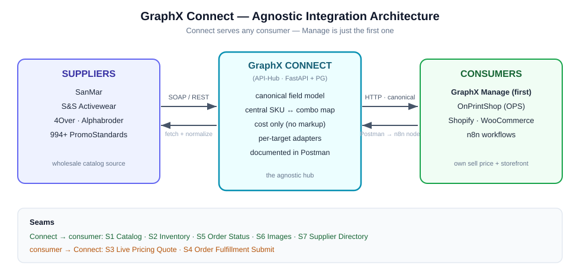

> ⚠️ **SUPERSEDED (2026-06-29).** The authoritative, decision-complete plan is **[`2026-06-29-connect-integration-plan-final.md`](2026-06-29-connect-integration-plan-final.md)**, which consolidates this spec, the sprint plan, and the master-shadow design and applies all post-meeting fixes. Kept for history.

# GraphX Connect — Integration Plan v2 (7 Phases, Agnostic API)

**Status:** `pending approval` (planning only — no code until explicit go-ahead)
**Date:** 2026-06-24 (rev. after the working-session review; updated 2026-06-26)
**Restructures:** the prior 7-phase Connect↔Manage roadmap, per the 2026-06-24 session with Christian.
**Execution:** see the sprint breakdown in [`2026-06-26-connect-manage-sprint-plan.md`](2026-06-26-connect-manage-sprint-plan.md) 

## 0. Headline
Connect is built as an **agnostic, open, documented API** — not a Manage-specific integration. Connect feeds *any* consumer (Manage, OPS, Shopify, WooCommerce, n8n) everything it knows about suppliers (catalog, inventory, images, live cost, fulfillment status) and accepts orders to place with suppliers. **Manage is just the first consumer.** Same 7 seams as before, now exposed as canonical, platform-neutral endpoints documented in **Postman** — which Christian then converts into an n8n node.

New customers connect through **configuration only** — no custom development required per tenant. A new tenant is a DB row + credentials. **Zero code deployment per customer.**

## 1. The 7 Integration Seams
| # | Direction | What | Why |
|---|---|---|---|
| S1 | Connect → consumer | **Catalog** — products, options, wholesale cost | Consumer needs the catalog to sell |
| S2 | Connect → consumer | **Inventory** — stock levels, discontinued flags | Consumer needs to know what's in stock |
| S3 | Connect → consumer | **Pricing (daily refresh)** — supplier cost refreshed by a daily cron, served from the catalog | Current cost without a per-request supplier call |
| S4 | consumer → Connect → supplier | **Order Fulfillment Submit** — place a confirmed order with the supplier (Connect serves the order *back to the supplier*) | Dropship/outsource orders go to the supplier via Connect |
| S5 | Connect → consumer | **Order Status** — confirmed, shipped, tracking | Jobs need live supplier status |
| S6 | Connect → consumer | **Product Images** — supplier images | Catalog display needs images |
| S7 | Connect → consumer | **Supplier Directory** — suppliers + capabilities | Sourcing needs to know what's available |

> ✅ **Confirmed (2026-06-26):** **S4 Order Fulfillment is in scope**, and Connect serves the order *back to the supplier* — so S4 runs **both directions** (consumer → Connect → supplier). **S3 real-time live pricing is deferred** — a **daily cron (~12:01 AM)** refreshes supplier cost into the catalog instead (prices don't change fast); a real-time "fire on product view" webhook with OPS is **backlogged** (Decision D3).

## 2. Foundation Rules (apply to every seam)
1. **Agnostic API first.** Endpoints assume nothing about the caller. Manage/OPS/Shopify are *targets*, mapped by adapters — never baked into the core.
2. **Documented + bidirectional, Postman-first.** Every endpoint (inbound + outbound) is documented in a Postman collection with examples, auth, and error shapes. **Christian converts the collection into an n8n node** (~15 min); we do **not** build the node.
3. **Canonical field model (Sandy's point — highest-risk item).** Use *common* field names, not OPS's exact SKUs/fields. The core uses platform-neutral names (`product_name`, `product_type`, `option_key`, `vendor_price`, …) and a **per-target adapter** maps them out. **No OPS/Manage field names appear in the core** — that's what makes it portable to Shopify/WooCommerce. ⚠️ **These canonical field names must be locked with Christian before any adapter is built (Decision D1). This blocks Phase 2 and everything after it.**
4. **Dynamic connections.** Suppliers and target platforms are config (rows), not code — connect/disconnect any supplier or consumer at runtime with no code change; the n8n node exposes them as dynamic fields.
5. **Connect owns the master mapping.** The **option-combination ↔ supplier-SKU** map lives in Connect, so order routing back to the supplier is correct regardless of which platform placed the order. Each **tenant catalog** also keeps a **line-for-line destination ID mapping** (e.g. OPS product ID 59 ↔ this product ↔ this exact SanMar item) so return calls and order placement are unambiguous. **Don't rely on OPS for the SKU map** — the earlier OPS breakage was just a missing size at product creation (now fixed); OPS's own SKU + inventory management API is due **~Mon/Tue, Jun 29–30**.
6. **Cost only, never markup.** Connect emits wholesale cost; the consumer owns sell price/markup. Prevents double markup.
7. **Master catalog + per-tenant shadow catalogs.** Connect owns one **master catalog** (canonical, all suppliers). Each tenant gets a **shadow catalog** that pulls from the master and is **curated** (a tenant lists only the products they want — not the full 100k+ supplier catalog) and holds that tenant's **negotiated costs** (tenant A may pay $1.00 where tenant B pays $2.15 for the same item). The shadow catalog is what makes correct per-tenant PO pricing back to the supplier possible — a single shared catalog cannot, and it avoids forcing every tenant to ingest the entire supplier catalog. *(Christian, 2026-06-26: "we need a master catalog and then each tenant has their own tenant-specific catalog that just pulls from the master and fine-tunes it.")*
8. **Idempotent + authenticated (API key → bearer token).** Every call is authenticated with an **API/authentication key**, exchanged for a short-lived **bearer token** (expiring, not long-lived) — **not** a session cookie. Calls are safe to repeat; re-syncs never duplicate rows or clobber a consumer's edits (overlay preserved).
9. **Config-driven tenant onboarding.** A new customer connects to a supplier via configuration only — no code deployment required. *( "New customers connect through configuration instead of customized development.")*

## 3. Architecture (agnostic — Connect serves many consumers)



<details><summary>Text version (fallback)</summary>

```
┌────────────┐  SOAP/REST  ┌─────────────────────┐ HTTP / GraphQL (canonical) ┌────────────────────────┐
│ SUPPLIERS  │◄───────────►│   GraphX Connect    │◄──────────────────────────►│  CONSUMERS / TENANTS   │
│ SanMar     │             │    (API-Hub)        │   documented in             │  Manage · OPS (GraphQL)│
│ S&S, 4Over │  adapters   │  FastAPI + PG       │   Postman → n8n node         │  Shopify · WooComm…    │
│ 994+ PS    │  normalize  │  master catalog +   │                             │  (per-tenant shadow    │
│            │             │  tenant shadow cats │                             │   catalogs)            │
└────────────┘             │  central SKU map    │                             └────────────────────────┘
      ▲                    └─────────────────────┘
      └── S4: Connect serves the consumer's order BACK to the supplier
   Connect SERVES: S1 Catalog · S2 Inventory · S4 Order→supplier · S5 Status · S6 Images · S7 Directory
   Connect RECEIVES: S4 Order (consumer→Connect).  S3 pricing = daily cron refresh (real-time webhook backlogged).
```
</details>

---

## 4. Phase Breakdown (7 phases)

### Phase 1 — Agnostic API Foundation + Postman Documentation (1–2 weeks)
**Goal:** Connect is a clean, documented, bidirectional API any platform can consume; the Postman collection is complete enough for Christian to generate an n8n node.
- **1a.** Inventory every existing Connect capability; define the **canonical request/response contract** per seam.
- **1b.** Ensure each endpoint works **both directions** and returns a consistent **error envelope**.
- **1c.** Build the **canonical field model + per-target adapter** seam (Manage adapter first). **Lock canonical field names with Christian before writing adapters — Decision D1; blocks all downstream phases.**
- **1d.** **Auth:** standardize on the **`X-Orchestrator-Key`** machine auth (the `integration_keys` table already backs it). ⚠️ **Reality check (verified live 2026-06-25):** today the admin/browse routes require the `auth_token` **session cookie** (`main.py` registers them with `dependencies=_auth`); `X-Orchestrator-Key` is **not yet wired** on them. Adding it is a build task — see Decision D6.
- **1e.** **Postman collection** — every endpoint, example payloads, auth, errors. *(Primary Phase-1 deliverable — [`postman/graphx-connect.postman_collection.json`](../postman/graphx-connect.postman_collection.json).)*
- **1f.** Hand the collection to **Christian → he builds the n8n node** and drops it into the dev n8n for cross-system testing.
- **1g.** Verify a **new tenant connects to a supplier via config only** — no code deployment.
- **Acceptance:** every documented endpoint callable from Postman with the machine key (401 without it); round-trips return canonical shapes; the collection generates a working n8n node; a new tenant onboards with zero code change.

### Phase 2 — Catalog (S1) (3–4 weeks)
**Goal:** stand up the **master catalog + per-tenant shadow catalogs**, and expose each supplier's catalog in canonical shape — products, options, wholesale cost — idempotently and overlay-safe.
> ⚠️ **Prerequisite before Phase 2 starts (Decision D2):** the SanMar apparel modeling decision must be made. Christian asked for a demo of both approaches (master-options vs. template-clone) on 1–2 products before committing. 
- **2a.** Classify **product vs option-set** at ingest/push (some suppliers ship standalone products; others expose configurable options). *Supplier-specific modeling rules live in the SanMar apparel modeling doc — not baked into this integration.*
- **2b. Master options exist first.** The product **attaches** pre-seeded master options in the target's master-option library — it never invents per-product options.
- **2c. Central SKU/stock map** — the option-combination ↔ supplier-SKU table lives in **Connect**; stock is keyed off it (not the consumer).
- **2d.** Idempotent + overlay-preserving re-sync (consumer's sell price / markup / visibility never clobbered).
- **2e. Master catalog.** Connect owns one canonical master catalog across all suppliers.
- **2f. Per-tenant shadow catalog.** Each tenant pulls from the master into a **curated** shadow catalog (only the products they want) and stores **negotiated per-tenant cost** — used for correct PO pricing back to the supplier.
- **2g. Destination ID mapping.** Each shadow-catalog line keeps a line-for-line destination mapping (e.g. OPS product ID ↔ product ↔ supplier item) so return calls / order placement are unambiguous.
- **Acceptance:** a supplier product is exposed as one canonical product with options + wholesale cost; a tenant shadow catalog curates a subset with its own negotiated cost; re-sync is idempotent and never overwrites consumer overlay; the SKU map round-trips a combination → supplier SKU; a destination ID round-trips to the correct supplier item.

### Phase 3 — Inventory & Availability (S2) (2 weeks)
Scheduled per-supplier poller → store qty per variant → serve in canonical shape; discontinued = soft-archive (never hard-delete). Cadence configurable (default 30 min).

### Phase 4 — Pricing Refresh (S3) — daily cron, not real-time (2 weeks)
> 🔄 **Changed 2026-06-26:** real-time per-request live pricing is **deferred**. Instead a **daily cron (~12:01 AM)** refreshes supplier cost into the master/shadow catalogs (prices don't change fast); consumers read cost from the catalog — no per-request supplier call.
- Daily scheduled cost refresh per supplier → write into the master catalog; tenant negotiated costs layered on top in the shadow catalog.
- The existing `/api/pricing/quote` (consumer markup quote) stays **as-is** — unchanged.
- **Backlog:** a real-time "fire on product view" webhook with OPS to fetch current cost — spec only, not built now.

### Phase 5 — Order Fulfillment Submit + Status (S4 + S5) (4–6 weeks)
> ✅ **S4 confirmed in scope (2026-06-26)** — Connect serves the order **both ways** (consumer → Connect → supplier).
`POST /api/fulfillment/submit` maps a confirmed order → supplier PO format → supplier PO API. Status propagates back to the consumer via **polling *or* a `callback_url` webhook**. A supplier-API outage never loses the order (retries).
- **Supplier-down fallback (Christian, 2026-06-26):** notify the tenant (email/notification) that the sync is down and hand them a **structured PO** so they can place the order manually (e.g. by phone); if they choose "place manually," **cancel the API call** so no duplicate order fires.

### Phase 6 — Product Images (S6) (2 weeks)
Adapters fetch supplier images; canonical catalog payload includes `images[]` with per-color tagging; re-sync updates changed URLs; consumer-uploaded images preserved.

### Phase 7 — Supplier Directory (S7) (1 week)
Serve the connected-supplier list + capabilities (dynamic); consumer caches with a TTL; **adding a supplier in Connect needs zero code change in the consumer.**

---

## 5. Build Order & Dependencies
```
Phase 1 — Agnostic API + Postman   (must be first)
   │   ⬆ Lock canonical field names with Christian before leaving Phase 1 (D1)
   │   ⬆ SanMar apparel modeling demo approved by Christian before Phase 2 (D2)
   ├── Phase 2 — Catalog (S1)
   │      └── Phase 6 — Images (S6)        ← extends the catalog payload
   ├── Phase 3 — Inventory (S2)            ← parallel after Phase 1
   ├── Phase 4 — Pricing Refresh (S3)      ← daily cron; after Phase 2
   │      └── Phase 5 — Fulfillment (S4+S5)← S4 confirmed; after Phase 4
   └── Phase 7 — Supplier Directory (S7)   ← parallel anytime after Phase 1
```
Critical path: Phase 1 → 2 → 4 → 5 (~10–15 weeks). Phases 3, 6, 7 run in parallel. *S4 fulfillment confirmed in scope; S3 reduced to a daily-cron pricing refresh.*

## 6. Risks & Mitigations
| # | Risk | Mitigation |
|---|---|---|
| R1 | Designing around Manage instead of agnostic | Canonical model + adapters; Manage is one adapter (Phase 1) |
| R2 | Double markup | Cost only; markup never applied in Connect payloads |
| R3 | Re-sync overwrites a consumer's edits | Ingest writes base only; overlay never touched |
| R4 | Cross-supplier SKU collision | Namespaced `{supplier_slug}:{supplier_sku}` + central SKU map |
| R5 | Unauthenticated abuse | API key → short-lived bearer token on every endpoint (not cookies) |
| R6 | Supplier API down at order time | Async submit + polling/callback; order never lost |
| R7 | Relying on OPS (gapped/buggy) | Connect self-sufficient; OPS is one optional target |
| R8 | Apparel size confused with physical size | Size is an **option**, not a physical dimension |
| R9 | Starting Phase 2 before SanMar modeling decision | Demo both approaches on 1–2 products; Christian approval first (D2) |
| R10 | Building adapters before canonical field names are locked | D1 must be signed off before any adapter code is written |
| R11 | Pricing/fulfillment scope drift | S4 confirmed in scope; S3 reduced to daily-cron refresh (D3 resolved 2026-06-26) |

## 7. Open Decisions (for Christian)
| ID | Decision | Phase | Recommendation | Status |
|---|---|---|---|---|
| D1 | Canonical field names | 1 | Lock before any adapter is built — blocks all downstream phases | ⚠️ Blocking |
| D2 | SanMar apparel modeling — master-options vs. template-clone | 2 | Demo both on 1–2 products first, then decide | ⚠️ Blocking Phase 2 |
| D3 | S3 + S4 scope | 4 & 5 | **RESOLVED (2026-06-26):** S4 in scope (both directions); S3 real-time **deferred** → daily-cron refresh; real-time webhook backlogged | ✅ Resolved |
| D4 | Inventory cadence | 3 | 30 min default, tunable per supplier | Open |
| D5 | First supplier fulfillment APIs (if S4 confirmed) | 5 | Highest-volume suppliers first | Open |
| D6 | Auth mechanism | 1 | **RESOLVED (2026-06-26):** drop the session cookie; use an **API/auth key → short-lived bearer token** | ✅ Resolved |

## 8. Out of Scope (v1) / Backlog
**Out of scope (v1):** n8n orchestration build (an AI tool generates + maintains the n8n node from the Postman collection — npm-installable); consumer-native catalog authoring UI; customer/contact sync; designer-studio / GraphX-Pay integration.
**Backlog (post-v1):** (a) **API introspection + AI "interrogator"** — point Connect at a new supplier's API docs and auto-build the connection by our rules (self-serve connection platform); (b) **real-time pricing webhook** with OPS (fire on product view).

## 9. Summary by Phase
| Phase | Seam | Weeks | Value |
|---|---|---|---|
| 1 — Agnostic API + Postman | All | 1–2 | Documented, consumable, n8n-ready API + config-driven onboarding |
| 2 — Catalog | S1 | 3–4 | Supplier catalog in canonical shape + cost |
| 3 — Inventory | S2 | 2 | Live stock + discontinued status |
| 4 — Pricing Refresh | S3 | 2 | Daily cron refresh of supplier cost (real-time deferred) |
| 5 — Fulfillment | S4+S5 | 4–6 | Full dropship/outsource loop (both directions) |
| 6 — Images | S6 | 2 | Catalog visuals |
| 7 — Supplier Directory | S7 | 1 | Dynamic supplier list |
| | | **~15–20 wks** | Complete agnostic Connect integration |

*S4 fulfillment confirmed in scope (2026-06-26); S3 reduced to a daily-cron pricing refresh.*
